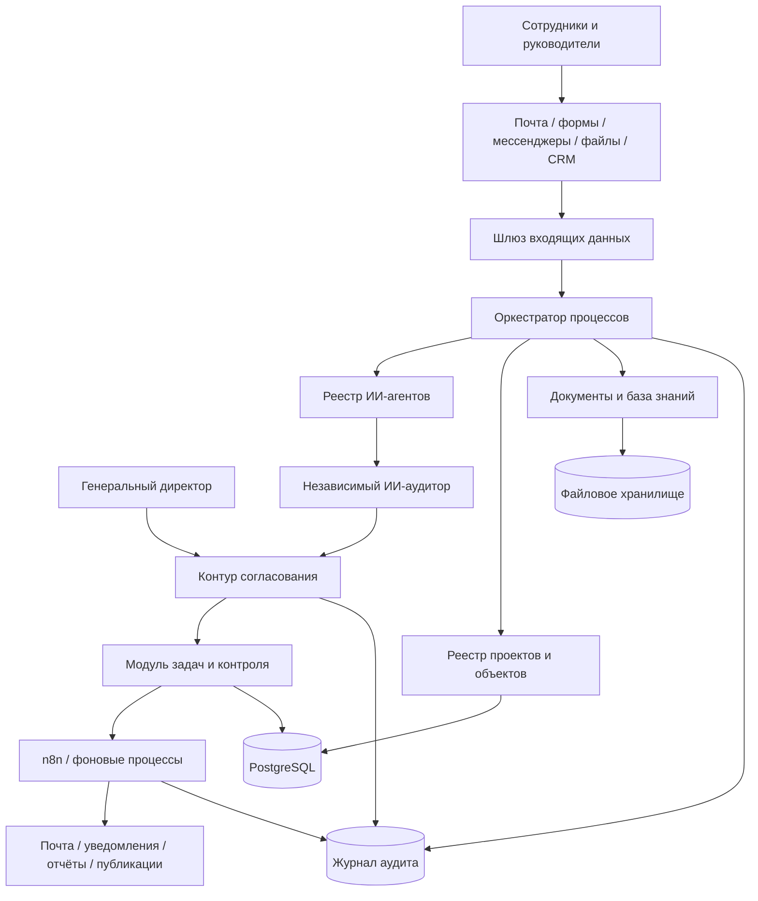
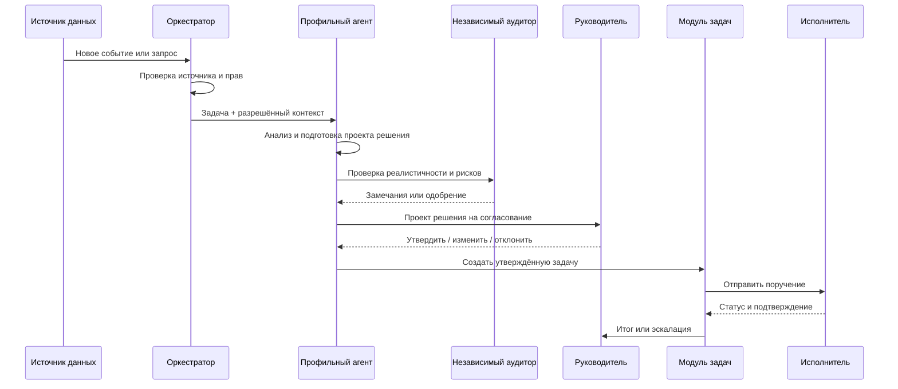

# ARCHITECTURE
## Архитектура цифровой операционной системы Badrudin AI OS для ООО «Экстра-Элит»

**Версия:** 0.1  
**Статус:** базовая архитектура для начала разработки  
**Связанные документы:** `MASTER_SPECIFICATION.md`, `AGENTS.md`  
**Назначение:** техническое руководство для Claude Code, разработчиков, интеграторов и владельца системы

---

## 1. Назначение документа

Настоящий документ определяет целевую архитектуру Badrudin AI OS — единой цифровой операционной системы для управления ООО «Экстра-Элит», строительными объектами, проектно-изыскательскими работами, архитектурой и дизайном, финансами, юридическими задачами, снабжением, документооборотом, маркетингом и контролем исполнения.

Архитектура должна обеспечить:

- единый центр управления организацией;
- работу нескольких специализированных ИИ-агентов;
- обязательное согласование критически важных действий человеком;
- сбор данных из электронной почты, рабочих групп, форм, файлов и CRM;
- автоматическое формирование проектов поручений;
- рассылку утверждённых поручений реальным сотрудникам;
- контроль сроков, обратной связи и подтверждений выполнения;
- ведение отдельного цифрового пространства по каждому объекту;
- хранение истории решений и действий;
- масштабирование на новые проекты, подразделения и компании.

---

## 2. Архитектурные принципы

### 2.1. Человек в контуре принятия решений

Критические решения не принимаются ИИ самостоятельно. Система должна поддерживать обязательный этап человеческого согласования для:

- денежных переводов и платежей;
- заключения, изменения и расторжения договоров;
- отправки юридически значимых писем;
- назначения ответственных лиц;
- кадровых решений;
- изменения проектных решений;
- утверждения смет и бюджетов;
- публикации официальных заявлений;
- закрытия критических задач;
- действий, влияющих на безопасность людей и объектов.

### 2.2. Сначала проект решения, затем действие

Каждый агент должен по умолчанию:

1. Получить входные данные.
2. Проверить их полноту.
3. Сформировать проект решения или поручения.
4. Передать результат независимому аудитору при необходимости.
5. Представить результат уполномоченному руководителю.
6. Выполнить действие только после подтверждения, если оно требуется.
7. Записать действие в журнал аудита.

### 2.3. Разделение ответственности

Каждый агент отвечает только за свою функциональную область. Агент не должен самовольно расширять полномочия или выполнять функции другого агента.

### 2.4. Проверяемость

Любой вывод системы должен содержать:

- источник данных;
- дату и время получения;
- уровень уверенности;
- перечень допущений;
- список недостающих данных;
- указание на необходимость проверки специалистом, если она требуется.

### 2.5. Модульность

Система строится из независимых модулей. Каждый модуль можно заменить или обновить без полной перестройки всей системы.

### 2.6. Безопасность по умолчанию

Доступ предоставляется только в объёме, необходимом для выполнения конкретной функции. Секреты, пароли и ключи не хранятся в открытом виде и не помещаются в GitHub.

### 2.7. Единый источник правды

Для каждого типа данных определяется один основной источник:

- задачи и статусы — операционная база;
- код и техническая документация — GitHub;
- официальные документы — корпоративное файловое хранилище;
- финансовые данные — бухгалтерская система;
- календарные события — корпоративный календарь;
- контакты — утверждённый справочник сотрудников и контрагентов.

---

## 3. Общая схема системы



---

## 4. Уровни архитектуры

Система состоит из семи основных уровней.

### 4.1. Уровень пользовательских интерфейсов

Назначение: предоставить людям удобный доступ к системе.

Компоненты:

- веб-панель генерального директора;
- веб-панель исполнительного директора;
- личные кабинеты сотрудников;
- карточки объектов;
- карточки задач;
- мобильный интерфейс;
- формы ежедневных отчётов;
- формы согласования;
- интерфейс общения с ИИ;
- интерфейс просмотра документов и истории действий.

Минимальная версия может начинаться с простой веб-панели и электронной почты, без отдельного мобильного приложения.

### 4.2. Уровень приёма данных

Назначение: принимать информацию из внешних источников и приводить её к единому формату.

Источники:

- электронная почта;
- Google Calendar или другой календарь;
- Google Drive или другое файловое хранилище;
- формы отчётности;
- разрешённые интеграции с WhatsApp Business Platform;
- Telegram-бот при необходимости;
- CRM;
- бухгалтерская система;
- загружаемые документы;
- фото- и видеоматериалы;
- данные, введённые вручную.

Все входящие данные должны проходить:

1. Идентификацию источника.
2. Проверку прав доступа.
3. Антивирусную проверку файлов.
4. Классификацию по объекту и типу данных.
5. Извлечение метаданных.
6. Запись в журнал приёма.
7. Передачу в оркестратор.

### 4.3. Уровень оркестрации

Оркестратор является центральным диспетчером системы.

Функции:

- определение типа входящего события;
- выбор нужного агента;
- сбор дополнительного контекста;
- запуск последовательности проверок;
- направление результата на согласование;
- создание и обновление задач;
- запуск автоматизаций;
- обработка ошибок;
- повторный запуск неудачных операций;
- запись полной истории выполнения.

Оркестратор не принимает бизнес-решения самостоятельно. Он управляет последовательностью действий.

### 4.4. Уровень ИИ-агентов

Каждый агент реализуется как отдельный логический модуль с фиксированными:

- названием;
- назначением;
- полномочиями;
- входными данными;
- выходными данными;
- инструментами;
- ограничениями;
- правилами эскалации;
- требованиями к согласованию;
- журналом действий.

Перечень агентов и их функции определены в `AGENTS.md`.

### 4.5. Уровень бизнес-модулей

Основные бизнес-модули:

- управление задачами;
- управление объектами;
- управление проектами;
- управление договорами;
- управление документами;
- исполнительная документация ПТО;
- снабжение и закупки;
- финансовый контроль;
- юридическая работа;
- проектирование;
- архитектура и дизайн;
- база материалов и поставщиков;
- SMM и маркетинг;
- KPI и отчётность;
- управление рисками;
- база знаний.

### 4.6. Уровень интеграций и автоматизаций

Интеграционный уровень связывает систему с внешними сервисами.

Предпочтительный инструмент автоматизации — n8n.

Примеры интеграций:

- получение и отправка электронной почты;
- работа с календарём;
- сохранение файлов;
- уведомления;
- получение отчётов с объектов;
- создание задач;
- запрос обратной связи;
- напоминания;
- официальная публикация контента через Meta API;
- синхронизация с CRM;
- обмен данными с бухгалтерской системой.

### 4.7. Уровень хранения данных и аудита

Состоит из:

- реляционной базы данных;
- файлового хранилища;
- поискового индекса;
- векторного хранилища для базы знаний;
- журнала аудита;
- резервных копий.

---

## 5. Основные программные компоненты

### 5.1. Frontend

Назначение: пользовательский интерфейс.

Предпочтительные технологии:

- Next.js или React;
- TypeScript;
- адаптивный интерфейс для компьютера и планшета;
- ролевое отображение информации;
- поддержка русского языка;
- возможность дальнейшего добавления мобильного приложения.

Главные экраны первой версии:

- вход в систему;
- главная сводка;
- список объектов;
- карточка объекта;
- список задач;
- карточка задачи;
- центр согласований;
- документы;
- отчёты;
- журнал действий.

### 5.2. Backend API

Назначение: бизнес-логика, безопасность, работа с базой и интеграциями.

Предпочтительная технология:

- Python;
- FastAPI;
- Pydantic для проверки данных;
- SQLAlchemy для работы с базой;
- Alembic для миграций;
- фоновые задачи через Celery, Dramatiq или аналогичный механизм.

Backend должен быть единственной точкой доступа к данным для интерфейса и агентов.

### 5.3. Agent Runtime

Назначение: безопасный запуск агентов.

Компоненты:

- реестр агентов;
- загрузчик системных инструкций;
- менеджер инструментов;
- менеджер контекста;
- механизм согласования;
- механизм аудита;
- ограничитель полномочий;
- проверка результата;
- повторные попытки;
- контроль стоимости и лимитов.

### 5.4. Workflow Engine

В первой версии роль движка процессов выполняет n8n.

Он отвечает за:

- расписания;
- триггеры;
- последовательности действий;
- отправку уведомлений;
- ожидание ответа;
- повторные напоминания;
- эскалации;
- интеграции с внешними сервисами.

Критическая бизнес-логика не должна храниться только внутри n8n. Основные правила должны быть реализованы в backend и задокументированы в GitHub.

> **Реализовано (центр уведомлений, in-app).** Персональные уведомления пользователя
> реализованы поверх существующей таблицы `notifications` (отдельная миграция не
> требуется). Канал только `in_app` — модуль показывает уведомления внутри интерфейса
> и **не отправляет** внешних писем и сообщений (§14; внешняя рассылка — отдельный
> утверждённый контур интеграций). Пользователь видит и отмечает прочитанными ТОЛЬКО
> свои уведомления (по `recipient_user_id`/`recipient_employee_id`); есть счётчик
> непрочитанных и отметка «прочитать всё». Внутренние уведомления другим адресатам
> создаёт роль с правом `notification.manage` (создание — в журнале аудита). API
> `/notifications`, экран «Уведомления» (рабочий контур, без mock).

### 5.5. Database

Основная база данных — PostgreSQL.

В базе хранятся:

- пользователи;
- роли;
- подразделения;
- проекты;
- объекты;
- задачи;
- согласования;
- сообщения;
- отчёты;
- документы и их метаданные;
- поставщики;
- материалы;
- финансовые показатели;
- риски;
- действия агентов;
- журнал аудита.

Подробная схема описывается в отдельном файле `DATABASE.md`.

### 5.6. File Storage

Файлы не должны храниться непосредственно в базе данных.

Для файлов используется объектное или корпоративное хранилище:

- S3-совместимое хранилище;
- Google Drive;
- Microsoft SharePoint;
- другое утверждённое защищённое хранилище.

В базе хранятся ссылки, метаданные, версии и контрольные суммы файлов.

### 5.7. Knowledge Base

База знаний обеспечивает поиск по документам и истории проектов.

Компоненты:

- обработка документов;
- разбиение на смысловые фрагменты;
- индексирование;
- полнотекстовый поиск;
- векторный поиск;
- фильтрация по объекту, дате, типу и правам доступа;
- обязательное указание источников в ответах.

Для векторного поиска допускается использование `pgvector` в PostgreSQL на первом этапе.

### 5.8. Audit Service

Журнал аудита должен быть неизменяемым для обычных пользователей.

Записываются:

- вход пользователя;
- просмотр чувствительных данных;
- создание и изменение задач;
- согласования;
- отправка писем;
- действия агентов;
- изменения ролей;
- загрузка и удаление файлов;
- ошибки интеграций;
- изменение критических настроек.

---

## 6. Архитектура работы ИИ-агента

Каждый агент должен выполнять стандартный цикл.



### 6.1. Входной пакет агента

Агент получает только необходимый контекст:

- идентификатор пользователя;
- роль пользователя;
- идентификатор объекта;
- формулировку запроса;
- связанные задачи;
- разрешённые документы;
- историю, необходимую для решения;
- ограничения;
- срок;
- требуемый формат результата.

### 6.2. Выходной пакет агента

Результат агента должен быть структурирован:

- краткий вывод;
- факты;
- анализ;
- предлагаемые действия;
- ответственные;
- сроки;
- риски;
- недостающие данные;
- требуемый уровень согласования;
- ссылки на источники;
- уровень уверенности.

### 6.3. Запреты для агента

Агенту запрещено:

- самостоятельно расширять доступ;
- выполнять непредусмотренные действия;
- скрывать допущения;
- выдавать предположение за подтверждённый факт;
- отправлять важное сообщение без согласования;
- удалять историю;
- передавать данные одного объекта пользователю без доступа;
- изменять финансовые и юридические документы без версии и журнала;
- использовать пароль или токен, переданный в открытом тексте.

---

## 7. Контур согласования

### 7.1. Типы согласований

- информационное ознакомление;
- согласование руководителем направления;
- согласование исполнительным директором;
- согласование генеральным директором;
- двойное согласование;
- согласование профильным специалистом;
- юридическая проверка;
- техническая проверка;
- финансовая проверка.

### 7.2. Матрица уровней риска (R0–R4)

Матрица использует единую шкалу риска `R0–R4`, определённую в `ACCESS_CONTROL.md`
(раздел 9) и утверждённую как единственная шкала для всей системы решением
`DOCS/DECISIONS.md` D-001. Прежние обозначения критичности «Низкий / Средний /
Высокий / Критический» приведены к этой шкале без изменения бизнес-смысла
маршрутов согласования.

| Уровень | Определение | Пример | Действие системы |
|---|---|---|---|
| R0 | Безопасное чтение | Просмотр разрешённых данных, поиск, сбор статуса, аналитика без изменения источника | Разрешённая автоматизация в пределах области доступа |
| R1 | Внутренний черновик | Черновик поручения, письма или отчёта, классификация входящего сообщения | ИИ выполняет автоматически; результат маркируется как черновик |
| R2 | Ограниченное внутреннее действие | Напоминание, назначение обычной задачи по утверждённому правилу, изменение некритического статуса | Автоматизация при наличии журнала, возможности отмены и владельца правила |
| R3 | Значимое действие | Письмо заказчику, изменение бюджета или ключевого срока, согласование расхода в пределах лимита, предоставление внешнего доступа | Согласование профильным специалистом и директором; при необходимости двойное согласование |
| R4 | Критическое действие | Платёж, договор, изменение проекта, кадровое решение, публикация, удаление или массовый экспорт, действие с риском для безопасности | Обязательное согласование генеральным директором и ответственным специалистом; усиленная аутентификация и полный аудит |

ИИ не выполняет действия уровня `R4` самостоятельно (решение `DOCS/DECISIONS.md`
D-002).

### 7.3. Механизм утверждения

Решение должно иметь варианты:

- утвердить;
- утвердить с изменениями;
- вернуть на доработку;
- отклонить;
- запросить дополнительную информацию;
- назначить другого согласующего.

Каждое действие фиксируется с датой, пользователем и комментарием.

---

## 8. Архитектура задач и контроля исполнения

### 8.1. Жизненный цикл задачи

```text
Черновик
  -> Ожидает согласования
  -> Утверждена
  -> Направлена исполнителю
  -> Принята в работу
  -> Выполняется
  -> Ожидается проверка
  -> Выполнена
  -> Закрыта
```

Альтернативные состояния:

```text
Требуется информация
Заблокирована
Просрочена
Возвращена на доработку
Отменена
```

### 8.2. Обязательные поля задачи

- номер;
- заголовок;
- полное описание;
- объект;
- проект;
- инициатор;
- исполнитель;
- контролёр;
- дата создания;
- срок;
- приоритет;
- ожидаемый результат;
- подтверждение выполнения;
- статус;
- зависимости;
- вложения;
- история изменений;
- уровень согласования.

### 8.3. Автоматический контроль

Контролёр исполнения должен:

1. Подтвердить доставку задачи.
2. Получить подтверждение принятия.
3. Напомнить до наступления срока.
4. Запросить статус.
5. Выявить препятствие.
6. Создать проект связанной задачи.
7. Эскалировать молчание или просрочку.
8. Запросить доказательство выполнения.
9. Передать результат проверяющему.
10. Закрыть задачу только после подтверждения.

---

## 9. Архитектура объектов и проектов

### 9.1. Изоляция данных

Каждый объект имеет собственный цифровой контур:

- карточку объекта;
- участников;
- задачи;
- документы;
- фотографии;
- видео;
- отчёты;
- финансы;
- снабжение;
- риски;
- переписку;
- историю решений.

Пользователь видит только те объекты, к которым ему предоставлен доступ.

### 9.2. Структура цифрового объекта

```text
Объект
├── Общая информация
├── Договоры
├── Исходные данные
├── Проектная документация
├── Сметы
├── График
├── Производство работ
├── ПТО
├── Закупки и поставки
├── Финансы
├── Фото и видео
├── Переписка
├── Риски
├── Задачи
├── Отчёты
└── Сдача объекта
```

### 9.3. Ежедневный отчёт

Ежедневный отчёт может поступать через форму, личный кабинет или разрешённый канал связи.

Система должна:

1. Определить объект.
2. Определить отправителя.
3. Проверить обязательные поля.
4. Сохранить фото и видео.
5. Извлечь выполненные объёмы.
6. Сопоставить их с графиком.
7. Выявить препятствия.
8. Подготовить сводку производственному директору.
9. Создать проекты задач.
10. Передать важные вопросы на согласование.

---

## 10. Потоки данных

### 10.1. Поручение от генерального директора

```text
Команда руководителя
-> ИИ-помощник генерального директора
-> структурирование поручения
-> проверка независимым аудитором при необходимости
-> подтверждение руководителем
-> создание задачи
-> отправка исполнителю
-> напоминания
-> сбор обратной связи
-> подтверждение выполнения
-> итоговая сводка руководителю
```

### 10.2. Сообщение из рабочей группы

```text
Сообщение / фото / видео
-> официальная интеграция или ручная пересылка
-> проверка источника
-> определение объекта
-> сохранение файла
-> извлечение фактов
-> профильный агент
-> проект задач или предупреждений
-> согласование
-> постановка на контроль
```

### 10.3. Входящее письмо

```text
Новое письмо
-> классификация
-> привязка к объекту или контрагенту
-> выделение сроков и обязательств
-> подготовка проекта ответа
-> юридическая или техническая проверка
-> согласование человеком
-> отправка
-> создание связанных задач
```

### 10.4. Проектирование

```text
Техническое задание
-> проверка исходных данных
-> план проектных работ
-> назначение разделов
-> разработка
-> междисциплинарная проверка
-> нормоконтроль
-> проверка ГИПом
-> выдача заказчику
-> реестр замечаний
-> корректировка
-> финальная выдача
```

### 10.5. Архитектура и дизайн

```text
Бриф заказчика
-> обмеры и исходные данные
-> концепция
-> планировочные решения
-> визуализация
-> подбор материалов
-> проверка реальных поставщиков
-> проверка бюджета и сроков поставки
-> рабочая документация
-> согласование
-> сопровождение реализации
```

### 10.6. Публикация контента

```text
Контент-план
-> сценарий и текст
-> подбор разрешённых материалов
-> проверка фактов и конфиденциальности
-> согласование руководителем
-> планирование через официальный инструмент Meta
-> публикация
-> сбор статистики
-> аналитический отчёт
```

---

## 11. Интеграционная архитектура

### 11.1. Электронная почта

Возможности:

- чтение разрешённых входящих писем;
- классификация;
- создание проектов ответов;
- отправка только в разрешённом режиме;
- создание задач из писем;
- контроль сроков ответа;
- привязка переписки к объекту.

### 11.2. WhatsApp

Интеграция допускается только через официально поддерживаемые бизнес-механизмы или утверждённый промежуточный процесс.

На первом этапе допускается:

- ручная пересылка важных сообщений в систему;
- загрузка ежедневного отчёта через веб-форму;
- отправка сотрудникам ссылки на форму;
- использование электронной почты как официального канала поручений.

### 11.3. Instagram и Meta

Используется официальный Meta API или Meta Business Suite.

Система не должна:

- использовать пароли в скриптах;
- имитировать действия человека через сомнительные сервисы;
- нарушать ограничения платформы;
- публиковать без установленного согласования.

### 11.4. GitHub

GitHub хранит:

- исходный код;
- техническую документацию;
- инструкции агентов;
- миграции базы;
- тесты;
- конфигурационные шаблоны;
- историю изменений.

GitHub не должен хранить:

- рабочие пароли;
- токены;
- ключи API;
- персональные данные;
- банковские данные;
- конфиденциальные договоры без специальной защиты.

### 11.5. Claude Code

Claude Code используется как инструмент разработки, а не как владелец системы.

Он должен:

- читать утверждённую документацию;
- создавать код по задачам;
- работать в отдельной ветке;
- запускать тесты;
- формировать понятное описание изменений;
- не отправлять код в основную ветку без проверки;
- не получать производственные секреты напрямую.

---

## 12. Безопасность

### 12.1. Аутентификация

Требования:

- уникальная учётная запись каждого пользователя;
- многофакторная аутентификация для руководителей;
- запрет общих аккаунтов;
- безопасное восстановление доступа;
- автоматическое завершение неактивных сессий.

### 12.2. Авторизация

Используется ролевая модель доступа с дополнительным ограничением по объектам.

Пример:

- прораб видит свой объект;
- инженер ПТО видит назначенные объекты;
- производственный директор видит все производственные объекты;
- бухгалтер видит финансовые данные, но не получает право менять техническую документацию;
- внешний подрядчик видит только предоставленные задачи и файлы.

### 12.3. Секреты

Секреты хранятся в:

- защищённом менеджере секретов;
- переменных окружения сервера;
- защищённых учётных данных n8n.

Файл `.env` не загружается в GitHub.

В репозитории хранится только `.env.example` без реальных значений.

### 12.4. Шифрование

- передача данных — только через HTTPS;
- чувствительные данные — шифрование при хранении;
- резервные копии — шифрование;
- ключи шифрования — отдельно от данных.

### 12.5. Защита персональных и конфиденциальных данных

Перед передачей данных внешней ИИ-модели система должна:

- проверить уровень конфиденциальности;
- удалить лишние персональные данные;
- ограничить контекст;
- по возможности заменить данные идентификаторами;
- зафиксировать факт передачи.

---

## 13. Надёжность и обработка ошибок

Система должна поддерживать:

- повторные попытки при временных ошибках;
- очередь неотправленных сообщений;
- защиту от повторного создания одинаковой задачи;
- контроль зависших процессов;
- ручное повторение операции;
- уведомление администратора;
- резервное копирование;
- восстановление после сбоя;
- журнал технических ошибок.

Критические действия должны быть идемпотентными: повторный запуск не должен приводить к двойной отправке письма, двойному платежу или созданию дублирующей задачи.

---

## 14. Наблюдаемость

Необходимо собирать:

- технические логи;
- бизнес-события;
- метрики времени ответа;
- количество ошибок;
- количество задач агентов;
- стоимость использования ИИ;
- процент успешных автоматизаций;
- очередь фоновых задач;
- состояние интеграций;
- время прохождения согласования.

Для руководства формируется понятная сводка без технического шума.

---

## 15. Рекомендуемая структура репозитория

```text
badrudin-ai-os/
├── README.md
├── AGENTS.md
├── docs/
│   ├── MASTER_SPECIFICATION.md
│   ├── ARCHITECTURE.md
│   ├── DATABASE.md
│   ├── API.md
│   ├── SECURITY.md
│   ├── ROADMAP.md
│   ├── DEPLOYMENT.md
│   └── USER_GUIDE.md
├── agents/
│   ├── registry.yaml
│   ├── executive_assistant/
│   ├── executive_director/
│   ├── execution_controller/
│   ├── production_director/
│   ├── chief_engineer/
│   ├── pto_engineer/
│   ├── foreman/
│   ├── estimator/
│   ├── finance/
│   ├── lawyer/
│   ├── procurement/
│   ├── strategic_development/
│   ├── design_mentor/
│   ├── supplier_research/
│   └── independent_auditor/
├── backend/
│   ├── app/
│   │   ├── api/
│   │   ├── core/
│   │   ├── models/
│   │   ├── schemas/
│   │   ├── services/
│   │   ├── workflows/
│   │   ├── integrations/
│   │   └── agents/
│   ├── tests/
│   └── pyproject.toml
├── frontend/
│   ├── app/
│   ├── components/
│   ├── services/
│   └── tests/
├── automation/
│   └── n8n/
├── database/
│   ├── migrations/
│   ├── seeds/
│   └── diagrams/
├── prompts/
├── templates/
├── infrastructure/
├── scripts/
├── tests/
├── .env.example
├── .gitignore
└── docker-compose.yml
```

---

## 16. Среды развертывания

### 16.1. Development

Используется разработчиками.

Особенности:

- тестовые данные;
- локальный запуск;
- безопасные тестовые интеграции;
- отсутствие доступа к реальным производственным данным.

### 16.2. Staging

Используется для проверки перед запуском.

Особенности:

- структура как в production;
- обезличенные или тестовые данные;
- приёмочное тестирование;
- проверка интеграций.

### 16.3. Production

Рабочая система.

Требования:

- ограниченный доступ;
- резервное копирование;
- мониторинг;
- журнал аудита;
- защищённые секреты;
- утверждённый порядок обновления.

---

## 17. Стратегия развертывания

Для первой версии рекомендуется Docker Compose на защищённом сервере или управляемой облачной платформе.

Минимальный набор сервисов:

```text
frontend
backend
worker
scheduler
postgresql
redis
n8n
object-storage
reverse-proxy
monitoring
```

Переход к Kubernetes рассматривается только при реальной необходимости масштабирования.

---

## 18. Нефункциональные требования

### 18.1. Производительность

- основные страницы должны открываться не дольше 3 секунд при нормальной нагрузке;
- создание обычной задачи — не дольше 2 секунд без учёта ответа ИИ;
- длительные операции выполняются в фоне;
- пользователь должен видеть состояние выполнения.

### 18.2. Доступность

Целевая доступность первой рабочей версии — не ниже 99,5% в месяц, исключая согласованные работы.

### 18.3. Масштабируемость

Архитектура должна поддерживать:

- увеличение количества объектов;
- подключение новых агентов;
- рост числа сотрудников;
- новые интеграции;
- создание отдельных контуров для других организаций.

### 18.4. Удобство

Интерфейс должен быть понятен сотруднику без технической подготовки.

Ключевые действия должны выполняться с минимальным количеством шагов.

### 18.5. Локализация

Основной язык — русский.

Архитектура должна позволять добавить:

- английский;
- арабский;
- другие языки.

---

## 19. Архитектура минимально рабочей версии

В MVP входят:

1. Пользователи и роли.
2. Реестр объектов.
3. Карточка объекта.
4. Реестр задач.
5. Согласование задач.
6. Рассылка поручений по электронной почте.
7. Подтверждение получения.
8. Напоминания и эскалации.
9. Загрузка ежедневного отчёта.
10. Фото- и файловые вложения.
11. Ежедневная сводка руководителю.
12. Журнал аудита.
13. Первый набор агентов:
    - помощник генерального директора;
    - исполнительный директор;
    - контролёр исполнения;
    - производственный директор;
    - независимый аудитор.

В MVP не включаются без отдельного решения:

- автоматические платежи;
- полная бухгалтерская интеграция;
- автоматическое чтение всех WhatsApp-групп;
- самостоятельное подписание документов;
- полностью автономная публикация;
- автоматическое утверждение проектных решений.

---

## 20. Критерии архитектурной готовности MVP

Архитектура считается реализованной, если:

- пользователь может войти по своей учётной записи;
- права доступа работают по ролям и объектам;
- объект можно создать и открыть;
- задачу можно подготовить с помощью агента;
- задачу можно согласовать;
- утверждённое поручение отправляется исполнителю;
- система получает статус исполнения;
- просрочка вызывает напоминание и эскалацию;
- файл или фото можно прикрепить как подтверждение;
- руководитель получает ежедневную сводку;
- все действия записываются в журнал;
- сбой интеграции не приводит к потере задачи;
- секреты отсутствуют в репозитории;
- существуют автоматические тесты критических сценариев.

---

## 21. Архитектурные решения, требующие отдельного документа

Следующие вопросы оформляются отдельными решениями ADR:

- выбор поставщика ИИ-модели;
- место размещения production-системы;
- выбор корпоративного файлового хранилища;
- способ официальной интеграции с WhatsApp;
- выбор CRM или отказ от внешней CRM;
- правила хранения персональных данных;
- политика резервного копирования;
- выбор системы электронной подписи;
- интеграция с бухгалтерией;
- допустимый уровень автономности каждого агента.

Формат имени файла:

```text
docs/adr/ADR-0001-название-решения.md
```

---

## 22. Правила разработки для Claude Code

Claude Code должен:

1. Сначала прочитать `MASTER_SPECIFICATION.md`, `AGENTS.md` и `ARCHITECTURE.md`.
2. Не изменять требования без отдельной задачи.
3. Перед созданием кода сформировать краткий план.
4. Работать небольшими проверяемыми этапами.
5. Добавлять автоматические тесты.
6. Не помещать секреты в код.
7. Не подключать новые внешние сервисы без документированного решения.
8. Не удалять существующие функции без согласования.
9. Обновлять документацию вместе с кодом.
10. После каждого этапа предоставлять:
    - перечень созданных файлов;
    - выполненные изменения;
    - результаты тестов;
    - известные ограничения;
    - инструкции для проверки человеком.

---

## 23. Следующие документы

После утверждения настоящей архитектуры создаются:

1. `DATABASE.md` — структура базы данных.
2. `API.md` — интерфейсы backend и интеграций.
3. `SECURITY.md` — подробная политика безопасности.
4. `ROADMAP.md` — этапы и очередность разработки.
5. `TASKS.md` — первые задачи для Claude Code.
6. `DEPLOYMENT.md` — инструкция по запуску.
7. `USER_GUIDE.md` — инструкция для пользователей.

---

## 24. Заключение

Badrudin AI OS строится как модульная, проверяемая и безопасная система управления организацией.

ИИ-агенты выполняют анализ, подготовку решений, координацию и контроль, но не заменяют ответственных руководителей и специалистов.

Архитектура должна развиваться поэтапно:

```text
Документация
-> минимально рабочая версия
-> пилот на одном объекте
-> исправление недостатков
-> подключение других объектов
-> расширение агентов
-> интеграция проектирования и дизайна
-> масштабирование системы
```

Главный принцип:

> Система должна ускорять работу, повышать прозрачность и дисциплину исполнения, сохраняя окончательный контроль за человеком.
