# DATABASE
## Модель данных Badrudin AI OS для ООО «Экстра-Элит»

**Версия:** 0.1  
**Статус:** базовая модель данных для начала разработки  
**Канон имён сущностей:** раздел 2.9 (решение `DOCS/DECISIONS.md` D-009)  
**Связанные документы:** `MASTER_SPECIFICATION.md`, `AGENTS.md`, `ARCHITECTURE.md`, `DECISIONS.md`  
**Основная СУБД:** PostgreSQL  
**Назначение:** руководство для Claude Code, разработчиков, интеграторов и владельца системы

---

## 1. Назначение документа

Настоящий документ определяет структуру базы данных Badrudin AI OS — единой цифровой операционной системы ООО «Экстра-Элит».

Модель данных должна поддерживать:

- сотрудников и организационную структуру;
- пользователей, роли и права доступа;
- ИИ-агентов и историю их действий;
- проекты, строительные объекты и дизайн-проекты;
- задачи, поручения, согласования и контроль исполнения;
- ежедневные отчёты, фото, видео и подтверждения выполнения;
- документы, версии документов и переписку;
- материалы, склады, остатки и движения;
- заявки, закупки, поставщиков и поставки;
- технику, оборудование, инструмент и техническое обслуживание;
- бюджеты, обязательства, счета и платежные статусы;
- риски, замечания, инциденты и корректирующие действия;
- журнал аудита и историю изменений.

Документ описывает логическую модель. Окончательная физическая схема создаётся через миграции и может уточняться в ходе разработки без нарушения основных принципов.

---

## 2. Основные принципы модели данных

### 2.1. Единый идентификатор

Для основных таблиц используется UUID в поле `id`.

Пример:

```sql
id UUID PRIMARY KEY DEFAULT gen_random_uuid()
```

UUID снижает риск конфликтов при интеграции нескольких систем и позволяет безопасно создавать записи в распределённых процессах.

### 2.2. Время и часовой пояс

Все даты и время в базе хранятся в UTC с типом `timestamptz`.

В интерфейсе время отображается в часовом поясе пользователя или организации.

Обязательные поля большинства таблиц:

```text
created_at
updated_at
created_by
updated_by
```

### 2.3. История и удаление

Для деловых данных применяется мягкое удаление:

```text
deleted_at
is_archived
```

Физическое удаление допускается только для технических, ошибочных или временных данных по утверждённому регламенту.

### 2.4. Аудит

Критические изменения записываются в `audit_events`.

Должны фиксироваться:

- пользователь или агент;
- действие;
- объект действия;
- старое и новое значение;
- дата и время;
- источник запроса;
- адрес устройства или технический идентификатор сессии;
- результат операции;
- основание или номер согласования.

### 2.5. Разделение организаций

Модель должна поддерживать несколько юридических лиц или подразделений.

Во всех бизнес-таблицах предусматривается поле:

```text
organization_id
```

На первом этапе основная организация — ООО «Экстра-Элит».

### 2.6. Разграничение по объектам

Пользователь может иметь доступ ко всей организации, отдельному направлению или конкретным проектам.

Доступ определяется сочетанием:

- роли;
- организации;
- подразделения;
- членства в проекте;
- уровня конфиденциальности документа;
- индивидуального разрешения.

### 2.7. Денежные значения

Денежные суммы хранятся как `numeric`, а не `float`.

Рекомендуемые поля:

```text
amount NUMERIC(18,2)
currency CHAR(3)
```

### 2.8. Файлы

Крупные файлы не хранятся непосредственно в PostgreSQL.

В базе хранятся:

- идентификатор;
- имя;
- путь или ключ объекта в хранилище;
- размер;
- контрольная сумма;
- MIME-тип;
- автор;
- уровень доступа;
- связь с проектом, задачей или документом.

### 2.9. Канонические имена сущностей (решение D-009)

Настоящий подраздел является нормативным. Он устраняет расхождения имён между
основной моделью (разделы 4–23) и модулями 32–33 в соответствии с решением
`DOCS/DECISIONS.md` D-009. При любом противоречии канонические имена ниже имеют
приоритет.

**Объекты и проекты.** Строительный объект — отдельная первоклассная сущность
`sites`, связанная с `projects`. `project_locations` описывают зоны, участки и
пикеты внутри объекта. Поля `site_id` во всех модулях ссылаются на `sites`.

**Склад и материалы.** Канонической является подробная модель раздела 33.
Разделы 12–13 приведены к ней (см. соответствующие разделы) и не образуют
отдельную модель.

**Техника, транспорт и инструмент.** Единая сущность техники и оборудования —
`equipment` (структура — по разделу 33). Транспорт является категорией
`equipment` (`equipment.asset_type`/категория). Отдельная сущность `vehicles`
не вводится; ссылки на транспорт используют `equipment_id`. Инструмент ведётся
сущностью `tools` (раздел 33.15).

**Журнал аудита.** Единый журнал — `audit_events` (раздел 20). Имена `audit_log`
(модуль 32) и `inventory_audit_log` (модуль 33) являются устаревшими; все модули
пишут в `audit_events`.

**Обмен с бухгалтерией.** `accounting_exports` — отдельная сущность
(см. раздел 32.5A); её структура доопределяется отдельным решением
(`DOCS/CONTEXT_GAPS.md` G-06).

Таблица соответствия имён (устаревшее → каноническое):

| Понятие | Устаревшие имена | Каноническое имя |
|---|---|---|
| Строительный объект | (отсутствовал как сущность) | `sites` |
| Каталог номенклатуры | `materials` (§12.2) | `inventory_items` (§33.3.1) |
| Категории номенклатуры | `material_categories` (§12.1) | `inventory_categories` (§33.3.2) |
| Единицы измерения | `unit` (текстовое поле) | `measurement_units` (§33.3.3) |
| Складские остатки | `stock_balances` (§13.3) | `inventory_balances` (§33.4.1) |
| Движения материалов | `stock_movements` (§13.5) | `inventory_transactions` (§33.4.2) |
| Партии | `material_batches` (§13.4) | `inventory_batches` (§33.5) |
| Резервы | `stock_reservations` (§13.6) | `inventory_transactions` (типы `reservation`/`reservation_release`) |
| Документы качества/сертификаты | `material_certificates` (§12.5) | `quality_documents` (§33.5) |
| Техника и оборудование | `equipment` (§15.2), `equipment_assets` (§33.16), `vehicles` | `equipment` |
| Обслуживание/ремонт | `maintenance_records` (§15.6) | `maintenance_orders` (§33.17) |
| Выдача инструмента | `tool_issues` (§15.9) | `tool_assignments` (§33.15) |
| Журнал аудита | `audit_log`, `inventory_audit_log` | `audit_events` (§20) |

Уникальные сущности, которые сохраняются и переносятся в каноническую модель
(привязка к `inventory_items`/`equipment`): `material_attributes` (гибкие
характеристики), `material_analogs` (аналоги с согласованием),
`equipment_inspections` (осмотры и поверки). Они описаны в приведённых к канону
разделах 12 и 15.

---

## 3. Общая схема данных

```mermaid
erDiagram
    ORGANIZATIONS ||--o{ DEPARTMENTS : содержит
    ORGANIZATIONS ||--o{ EMPLOYEES : нанимает
    EMPLOYEES ||--o| USERS : имеет_учетную_запись
    USERS }o--o{ ROLES : получает
    ROLES }o--o{ PERMISSIONS : включает
    ORGANIZATIONS ||--o{ AI_AGENTS : использует

    ORGANIZATIONS ||--o{ PROJECTS : ведет
    PROJECTS ||--o{ SITES : включает
    SITES ||--o{ PROJECT_LOCATIONS : делится_на
    PROJECTS ||--o{ PROJECT_MEMBERS : включает
    EMPLOYEES ||--o{ PROJECT_MEMBERS : участвует
    PROJECTS ||--o{ TASKS : содержит
    TASKS ||--o{ TASK_ASSIGNMENTS : назначается
    EMPLOYEES ||--o{ TASK_ASSIGNMENTS : исполняет
    TASKS ||--o{ TASK_UPDATES : имеет
    TASKS ||--o{ TASK_EVIDENCE : подтверждается
    TASKS ||--o{ APPROVALS : согласуется

    PROJECTS ||--o{ DAILY_REPORTS : получает
    DAILY_REPORTS ||--o{ FILES : прикладывает
    PROJECTS ||--o{ DOCUMENTS : содержит
    DOCUMENTS ||--o{ DOCUMENT_VERSIONS : версионируется

    ORGANIZATIONS ||--o{ SUPPLIERS : работает_с
    ORGANIZATIONS ||--o{ INVENTORY_ITEMS : каталогизирует
    ORGANIZATIONS ||--o{ WAREHOUSES : имеет
    WAREHOUSES ||--o{ INVENTORY_BALANCES : хранит
    INVENTORY_ITEMS ||--o{ INVENTORY_BALANCES : учитывается
    INVENTORY_ITEMS ||--o{ INVENTORY_TRANSACTIONS : движется
    WAREHOUSES ||--o{ INVENTORY_TRANSACTIONS : фиксирует
    PROJECTS ||--o{ MATERIAL_REQUESTS : запрашивает
    MATERIAL_REQUESTS ||--o{ MATERIAL_REQUEST_LINES : включает
    MATERIAL_REQUESTS ||--o{ PURCHASE_ORDERS : преобразуется
    SUPPLIERS ||--o{ PURCHASE_ORDERS : получает
    PURCHASE_ORDERS ||--o{ GOODS_RECEIPTS : поставляется

    ORGANIZATIONS ||--o{ EQUIPMENT : владеет
    EQUIPMENT ||--o{ EQUIPMENT_ASSIGNMENTS : назначается
    PROJECTS ||--o{ EQUIPMENT_ASSIGNMENTS : использует
    EQUIPMENT ||--o{ MAINTENANCE_ORDERS : обслуживается
    ORGANIZATIONS ||--o{ TOOLS : владеет_инструментом
    TOOLS ||--o{ TOOL_ASSIGNMENTS : выдается

    PROJECTS ||--o{ RISKS : имеет
    PROJECTS ||--o{ BUDGETS : планируется
    BUDGETS ||--o{ BUDGET_LINES : включает
    PROJECTS ||--o{ FINANCIAL_COMMITMENTS : создает
```



---

## 4. Организация, сотрудники и доступ

### 4.1. Таблица `organizations`

Назначение: юридические лица, филиалы или самостоятельные контуры системы.

Основные поля:

```text
id
legal_name
short_name
inn
kpp
ogrn
legal_address
actual_address
timezone
base_currency
status
created_at
updated_at
```

### 4.2. Таблица `departments`

Назначение: подразделения организации.

Примеры:

- руководство;
- производство;
- проектное подразделение;
- ПТО;
- снабжение;
- бухгалтерия;
- юридическая служба;
- архитектура и дизайн;
- стратегическое развитие;
- маркетинг.

Основные поля:

```text
id
organization_id
parent_department_id
name
code
manager_employee_id
status
```

### 4.3. Таблица `positions`

Назначение: справочник должностей.

Основные поля:

```text
id
organization_id
name
code
description
approval_level
```

### 4.4. Таблица `employees`

Назначение: реальные сотрудники и привлечённые специалисты.

Основные поля:

```text
id
organization_id
department_id
position_id
manager_employee_id
full_name
work_email
work_phone
employment_type
hire_date
dismissal_date
status
personnel_number
notes
```

Поле `employment_type` может принимать значения:

```text
staff
contractor
consultant
external_specialist
```

### 4.5. Таблица `users`

Назначение: учётные записи для входа в систему.

Основные поля:

```text
id
employee_id
email
password_hash
mfa_enabled
status
last_login_at
failed_login_count
locked_until
preferred_language
timezone
```

Пароли никогда не хранятся в открытом виде.

### 4.6. Таблицы `roles`, `permissions`, `user_roles`, `role_permissions`

Назначение: ролевая модель доступа.

Примеры ролей:

```text
system_owner
general_director
executive_director
production_director
chief_engineer
pto_engineer
foreman
estimator
accountant
lawyer
procurement_manager
project_manager
designer
viewer
external_contractor
```

Примеры разрешений:

```text
project.view
project.create
project.update
task.create
task.approve
task.assign
document.sign
finance.view
finance.approve
warehouse.manage
equipment.assign
agent.run
audit.view
```

### 4.7. Таблица `project_access`

Назначение: дополнительные права пользователя на конкретный проект.

Основные поля:

```text
id
project_id
user_id
access_level
valid_from
valid_until
granted_by
```

---

## 5. ИИ-агенты и их запуски

> **Статус реализации (миграция 0024).** Оркестратор ИИ-агентов (ROADMAP этап 6,
> AGENTS.md §2/§15) реализован как **governance-контур с человеком в контуре** поверх
> существующих `ai_agents` и `agent_runs` — **без дублирования**. Добавлена сущность
> `agent_proposals`: агент по итогам запуска формирует предложение (задача, документ,
> предупреждение, заявка, риск, заметка), которое **не имеет силы до утверждения
> человеком** (AGENTS.md §2.1). Цикл: реестр агентов (регистрация, активация) →
> запуск (`agent_runs`, статусы pending→completed|failed) → предложение (`pending`) →
> **утверждение/отклонение человеком** (`approved`/`rejected`) → **применение**
> утверждённого через общий сервис (тип `task` создаёт поручение через
> `services.core.create_task`, `applied`). Применять можно только утверждённое
> предложение; повторная обработка запрещена. **RBAC**: `agent.view` (реестр/запуски/
> предложения/сводка), `agent.manage` (регистрация, статус, запуск, фиксация
> результата, формирование предложения), `agent.approve` (утверждение и применение —
> окончательное решение человека). **ABAC**: предложения с проектом ограничены доступом
> к проекту. Все действия — в `audit_events`.
>
> **Важно (D-010, CLAUDE.md §5):** фактический вызов языковой модели здесь НЕ
> производится — вход/результат запуска фиксируются как данные, предложения проходят
> человеческое утверждение; вызов модели выполняется отдельным утверждённым коннектором
> (провайдер — после юридической проверки). API — префикс `/agents`; экран рабочего
> контура — `/agents`. Governance-цикл покрыт тестами.

### 5.1. Таблица `ai_agents`

Назначение: реестр всех агентов.

Основные поля:

```text
id
organization_id
code
name
description
agent_type
model_provider
model_name
system_prompt_version
status
requires_human_approval
default_risk_level
configuration_json
```

Примеры `code`:

```text
executive_assistant
execution_controller
production_director_agent
chief_engineer_agent
pto_agent
estimator_agent
lawyer_agent
finance_agent
procurement_agent
strategic_development_agent
design_mentor
supplier_research_agent
independent_auditor
```

### 5.2. Таблица `agent_runs`

Назначение: каждый запуск агента.

Основные поля:

```text
id
agent_id
organization_id
project_id
initiated_by_user_id
parent_run_id
trigger_type
input_summary
input_payload_json
output_summary
output_payload_json
status
risk_level
started_at
finished_at
error_message
tokens_in
tokens_out
estimated_cost
```

### 5.3. Таблица `agent_tool_calls`

Назначение: вызовы внешних инструментов агентом.

Основные поля:

```text
id
agent_run_id
tool_name
request_json
response_summary
status
started_at
finished_at
error_message
```

Секреты, токены и персональные данные не должны попадать в журнал в открытом виде.

### 5.4. Таблица `agent_reviews`

Назначение: проверка результата независимым аудитором или ответственным сотрудником.

Основные поля:

```text
id
agent_run_id
reviewer_user_id
reviewer_agent_id
review_type
verdict
findings
required_corrections
created_at
```

Значения `verdict`:

```text
approved
approved_with_comments
revision_required
rejected
insufficient_data
```

---

## 6. Проекты и объекты

### 6.1. Таблица `projects`

Назначение: единый реестр строительных, проектных и дизайнерских проектов.

Основные поля:

```text
id
organization_id
parent_project_id
project_type
code
name
description
customer_id
contract_id
address
latitude
longitude
project_manager_id
production_director_id
chief_engineer_id
pto_engineer_id
foreman_id
estimator_id
status
priority
start_date
planned_end_date
actual_end_date
contract_amount
currency
completion_percent
confidentiality_level
```

Значения `project_type`:

```text
construction
linear_infrastructure
design_engineering
survey
interior_design
architecture
public_space
maintenance
internal
```

Примечание (миграция 0014_crm): поле `customer_id` формализовано как внешний
ключ на `counterparties.id` (заказчик проекта — контрагент CRM). Проект
создаётся из выигранной сделки при утверждённом/подписанном договоре
(см. раздел 34).

### 6.1A. Таблица `sites`

Назначение: строительный объект (площадка) — первоклассная сущность в составе
проекта (решение D-009). Проект может включать один или несколько объектов;
каждый объект имеет собственный цифровой контур (задачи, отчёты, документы,
финансы, снабжение, риски).

Основные поля:

```text
id
organization_id
project_id
code
name
description
address
latitude
longitude
site_manager_id
responsible_foreman_id
status
start_date
planned_end_date
actual_end_date
confidentiality_level
created_at
updated_at
```

Поле `site_id` в задачах, отчётах, складских, финансовых и иных операциях
ссылается на эту таблицу. `project_locations` (см. 6.5) описывают зоны и участки
внутри объекта.

### 6.2. Таблица `project_members`

Назначение: команда проекта.

Основные поля:

```text
id
project_id
employee_id
project_role
responsibility
joined_at
left_at
status
```

### 6.3. Таблица `project_milestones`

Назначение: контрольные точки проекта.

Основные поля:

```text
id
project_id
name
description
planned_date
actual_date
status
weight
approval_required
```

### 6.4. Таблица `project_status_history`

Назначение: история изменения статуса и процента готовности.

Основные поля:

```text
id
project_id
old_status
new_status
old_completion_percent
new_completion_percent
reason
changed_by
changed_at
```

### 6.5. Таблица `project_locations`

Назначение: участки, корпуса, зоны, трассы и пикеты внутри объекта (`sites`).

Основные поля:

```text
id
project_id
site_id
parent_location_id
location_type
name
code
description
coordinates_json
```

Поле `site_id` связывает зону с объектом (`sites`); `project_id` сохраняется для
удобства фильтрации по проекту.

---

## 7. Задачи, поручения и контроль исполнения

> **Статус реализации (миграция 0021).** Контроль исполнения поручений (ROADMAP
> этап 4, §18/§20) реализован полным рабочим циклом поверх существующих `tasks`,
> `task_updates`, `task_assignments` и `notifications` — **без дублирования**.
> Добавлены только служебные поля контроля в `tasks`: `blocked_reason` (причина
> текущей блокировки для доски), `escalation_level` (счётчик эскалаций) и
> `escalated_at`. Жизненный цикл контроля: **препятствие** (исполнитель → статус
> `blocked`, запись `task_updates.type=blocker`, уведомление ответственному) →
> **снятие**; **вопрос** (`waiting_for_information`) → **ответ** (`in_progress`);
> **эскалация** (просрочка/затянувшееся препятствие → `escalation_level++`,
> уведомление, при просрочке статус `overdue`); **возврат на доработку**
> (`returned_for_revision`); **комментарии** и **лента активности** — `task_updates`.
> Просрочка определяется по `due_at`. **Уведомления** ответственным создаются в
> `notifications` (ранее сущность не заполнялась) с отметкой о прочтении. **RBAC**:
> чтение доски/ленты/уведомлений — `task.view`; препятствия/вопросы/комментарии
> (исполнитель) — `task.execute`; ответы/снятие препятствия/эскалация (контролёр) —
> `task.assign`; возврат на доработку (руководитель) — `task.approve`. **ABAC**:
> доступ к поручению через его проект. Все действия — в `audit_events`. API — под
> префиксом `/task-control`; экран рабочего контура — `/tasks/control`. Сквозной
> цикл покрыт интеграционными тестами.

### 7.1. Таблица `tasks`

Назначение: все поручения и задачи системы.

Основные поля:

```text
id
organization_id
project_id
parent_task_id
source_type
source_id
number
title
description
expected_result
priority
status
risk_level
planned_start_at
due_at
completed_at
approval_required
created_by_user_id
created_by_agent_id
owner_employee_id
confidentiality_level
```

Значения `status`:

```text
draft
pending_approval
approved
sent
accepted
in_progress
waiting_for_information
blocked
pending_review
completed
returned_for_revision
overdue
closed
cancelled
```

### 7.2. Таблица `task_assignments`

Назначение: один или несколько исполнителей.

Основные поля:

```text
id
task_id
employee_id
assignment_role
assigned_at
accepted_at
response_due_at
status
assigned_by
```

Значения `assignment_role`:

```text
responsible
executor
co_executor
reviewer
observer
```

### 7.3. Таблица `task_updates`

Назначение: ответы, статусы, комментарии и запросы помощи.

Основные поля:

```text
id
task_id
author_user_id
author_agent_id
update_type
message
progress_percent
blocker_category
created_at
```

Значения `update_type`:

```text
comment
status_change
progress
blocker
question
answer
reminder
escalation
completion_report
```

### 7.4. Таблица `task_evidence`

Назначение: доказательства выполнения.

Основные поля:

```text
id
task_id
file_id
evidence_type
description
location_id
captured_at
submitted_by
verification_status
verified_by
verified_at
```

Значения `evidence_type`:

```text
photo
video
document
act
measurement
invoice
signed_letter
system_record
```

### 7.5. Таблица `task_dependencies`

Назначение: зависимости между задачами.

Основные поля:

```text
id
predecessor_task_id
successor_task_id
dependency_type
lag_minutes
```

### 7.6. Таблица `task_reminders`

Назначение: плановые и автоматические напоминания.

Основные поля:

```text
id
task_id
recipient_employee_id
scheduled_at
channel
message_template
status
sent_at
```

### 7.7. Таблица `task_escalations`

Назначение: эскалации просрочек и препятствий.

Основные поля:

```text
id
task_id
reason
escalation_level
recipient_employee_id
created_at
resolved_at
resolution
```

---

## 8. Согласования и решения руководства

### 8.1. Таблица `approvals`

Назначение: согласование задач, документов, платежей, закупок и решений агентов.

Основные поля:

```text
id
organization_id
entity_type
entity_id
approval_type
requested_by_user_id
requested_by_agent_id
status
current_step
requested_at
completed_at
```

Значения `status`:

```text
pending
in_review
approved
approved_with_conditions
rejected
cancelled
expired
```

### 8.2. Таблица `approval_steps`

Назначение: последовательность согласующих лиц.

Основные поля:

```text
id
approval_id
step_number
approver_user_id
approver_role_id
decision
comment
decided_at
```

### 8.3. Таблица `management_decisions`

Назначение: важные решения генерального и исполнительного директора.

Основные поля:

```text
id
organization_id
project_id
number
title
description
basis
decision_text
decision_maker_id
decided_at
valid_until
status
```

---

## 9. Ежедневные отчёты и производственные данные

> **Статус реализации (миграция 0020).** Мобильный ежедневный отчёт прораба (§18)
> реализован полным рабочим циклом поверх существующих `daily_reports`,
> `daily_report_work_items`, `daily_report_headcount`, `daily_report_issues` и `files`
> — **без дублирования**. Расширения: `daily_report_work_items.task_id` (связь
> выполненной работы с задачей-поручением), `daily_reports.reviewed_by_user_id`/
> `review_comment` (проверка руководителем), новые сущности `daily_report_equipment`
> (техника на объекте за смену) и `daily_report_files` (несколько фото/файлов-
> доказательств на отчёт, при необходимости с привязкой к конкретной работе).
>
> **Цикл**: прораб составляет отчёт по объекту (работы и объёмы, численность по
> профессиям, техника, проблемы/риски, фото), отправляет на проверку; статусы
> `draft → submitted → approved | rejected | correction_required` (возврат на
> доработку снова открывает отчёт для правок). **Фото/файлы** сохраняются в MinIO
> через `services.storage.register_file` с проверкой типа и размера (D-008); в БД —
> только метаданные и связь. **Отправка** создаёт `approvals` (`daily_report_review`),
> **проверку** выполняет руководитель/ПТО. **RBAC**: `daily_report.view` (чтение),
> `daily_report.manage` (составление, прораб), `daily_report.approve` (проверка).
> **ABAC**: доступ к отчёту через его проект. После отправки правки закрыты. Все
> действия — в `audit_events`. API — под префиксом `/field-reports`; экран рабочего
> контура — `/personnel/field-report`. Сквозной цикл покрыт интеграционным тестом.

### 9.1. Таблица `daily_reports`

Назначение: ежедневные отчёты с объектов.

Основные поля:

```text
id
project_id
report_date
reporting_employee_id
weather_summary
shift_start
shift_end
workers_count
summary
work_completed
problems
materials_needed
equipment_needed
decisions_needed
plan_next_day
status
submitted_at
approved_at
```

### 9.2. Таблица `daily_report_work_items`

Назначение: объёмы выполненных работ.

Основные поля:

```text
id
daily_report_id
location_id
work_type
unit
planned_quantity
actual_quantity
cumulative_quantity
notes
```

### 9.3. Таблица `daily_report_resources`

Назначение: люди, техника и материалы, использованные за смену.

Основные поля:

```text
id
daily_report_id
resource_type
resource_id
quantity
unit
hours_used
notes
```

### 9.4. Таблица `site_incidents`

Назначение: аварии, нарушения, простои и события на объекте.

Основные поля:

```text
id
project_id
location_id
incident_type
severity
occurred_at
description
immediate_actions
reported_by
investigation_status
closed_at
```

---

## 10. Документы, версии и переписка

> **Статус реализации (миграция 0023).** «Единый входящий поток» (ROADMAP этап 5,
> §18) реализован как **надстройка сортировки** над существующей перепиской без
> дублирования: новая таблица `inbox_items` хранит очередь обращений на разбор и
> связывается с исходной коммуникацией (`communications.id` через `communication_id`/
> `source_id`) и с созданной задачей (`tasks`) идентификаторами. Жизненный цикл:
> `new → classified → (in_progress) → converted | dismissed`. **Классификация**
> (категория/приоритет/проект/контрагент/исполнитель) → **конверсия в задачу**
> (переиспользует `services.core.create_task` — задачи не дублируются) либо отметка
> иной цели (документ/заявка/риск/лид) → или **отклонение** с причиной. **RBAC**:
> `inbox.view` (очередь/сводка), `inbox.manage` (приём, разбор, конверсия). **ABAC**:
> обращения с проектом ограничены доступом к проекту; без проекта — общий контур.
> Все действия — в `audit_events`. Приём внешних сообщений (почта, официальные
> мессенджеры) выполняется отдельными коннекторами и требует настройки доступа —
> здесь реализован внутренний контур приёма и маршрутизации. API — префикс `/inbox`;
> экран рабочего контура — `/inbox`. Жизненный цикл покрыт тестами.

### 10.1. Таблица `documents`

Назначение: карточка документа.

Основные поля:

```text
id
organization_id
project_id
document_type
number
title
description
owner_employee_id
status
confidentiality_level
current_version_id
registered_at
valid_from
valid_until
```

Значения `document_type`:

```text
contract
additional_agreement
letter
claim
technical_specification
design_documentation
working_documentation
estimate
act
invoice
protocol
report
instruction
permit
certificate
executive_documentation
other
```

### 10.2. Таблица `document_versions`

Назначение: версии документа.

Основные поля:

```text
id
document_id
version_number
file_id
change_summary
prepared_by
approved_by
status
created_at
```

### 10.3. Таблица `document_links`

Назначение: связи документов с задачами, закупками, платежами и другими документами.

Основные поля:

```text
id
document_id
linked_entity_type
linked_entity_id
link_type
```

### 10.4. Таблица `communications`

Назначение: входящие и исходящие сообщения — единый центр коммуникаций CRM
(письма, звонки, встречи, сообщения мессенджеров). Реализована в модуле «Ядро
CRM» (миграция 0014_crm).

Основные поля:

```text
id
organization_id
counterparty_id
contact_id
lead_id
deal_id
project_id
channel
external_message_id
thread_id
direction
subject
body_text
occurred_at
classification
processing_status
responsible_employee_id
linked_task_id
```

Значения `channel`:

```text
email
whatsapp_business
telegram
web_form
internal_chat
manual
call
meeting
```

Примечания:

- сообщение может порождать задачу (`tasks`) — связь через `linked_task_id`,
  без дублирования; `processing_status` принимает `new | processed |
  task_created | ignored`;
- `direction` — `inbound | outbound | internal`; отправитель/получатели
  представлены ссылками на контрагента/контакт и ответственного сотрудника
  (`sender`/`recipients` из ранней редакции заменены нормализованными связями).

### 10.5. Таблица `files`

Назначение: метаданные файлов.

Основные поля:

```text
id
organization_id
project_id
storage_provider
storage_key
original_name
mime_type
size_bytes
checksum_sha256
uploaded_by
uploaded_at
virus_scan_status
confidentiality_level
metadata_json
```

---

## 11. Контрагенты и поставщики

### 11.1. Таблица `counterparties`

Назначение: заказчики, подрядчики, субподрядчики, поставщики и партнёры.

Основные поля:

```text
id
organization_id
counterparty_type
legal_name
short_name
inn
kpp
ogrn
legal_address
actual_address
website
status
risk_rating
notes
```

### 11.2. Таблица `counterparty_contacts`

Назначение: контактные лица контрагента. Реализована в модуле «Ядро CRM»
(миграция 0014_crm).

Основные поля:

```text
id
organization_id
counterparty_id
full_name
position
email
phone
messenger
is_primary
consent_given
consent_date
status
notes
```

Примечания по защите ПДн (решение владельца):

- телефон (`phone`) и e-mail (`email`) — персональные данные; их просмотр в
  открытом виде требует права `crm.contact.pii`. Для остальных пользователей
  значения маскируются на уровне сервиса, в ответе выставляется признак
  `pii_masked`;
- хранится согласие на обработку (`consent_given`) и его дата (`consent_date`);
- в тестовой среде используются только обезличенные данные (D-011).

### 11.3. Таблица `suppliers`

Назначение: расширенные сведения о поставщике.

Основные поля:

```text
id
counterparty_id
supplier_categories
regions
payment_terms
delivery_terms
lead_time_days
minimum_order_amount
rating
quality_rating
reliability_rating
last_verified_at
status
```

### 11.4. Таблица `supplier_products`

Назначение: связь поставщика с материалами и товарами.

Основные поля:

```text
id
supplier_id
material_id
supplier_sku
supplier_name
price
currency
price_valid_until
lead_time_days
minimum_quantity
availability_status
product_url
last_checked_at
```

### 11.5. Таблица `supplier_checks`

Назначение: проверки надёжности и актуальности.

Основные поля:

```text
id
supplier_id
check_type
result
risk_level
source
checked_at
checked_by
notes
```

---

## 12. Каталог материалов (приведён к канону — раздел 33)

Каталог номенклатуры материалов, изделий и товаров ведётся канонической моделью
раздела 33 (решение D-009). Настоящий раздел не определяет отдельные таблицы, а
фиксирует соответствие имён и сохраняет уникальные требования, не покрытые
разделом 33.

### 12.1. Соответствие канону

| Прежняя сущность (§12) | Каноническая сущность (§33) |
|---|---|
| `material_categories` | `inventory_categories` (§33.3.2) |
| `materials` | `inventory_items` (§33.3.1) |
| `material_certificates` | `quality_documents` (§33.5) |
| единица измерения (поле `unit`) | `measurement_units` (§33.3.3) |

Категории, наименования, характеристики, требования к сертификатам, срокам
годности и условиям хранения описаны полями `inventory_items` и
`inventory_categories` (§33.3) и сущностью `quality_documents` (§33.5).

### 12.2. Гибкие характеристики — `material_attributes`

Уникальная сущность, сохранённая из прежней модели и привязанная к
`inventory_items`.

Основные поля:

```text
id
item_id
attribute_name
attribute_value
unit
source
```

Примеры характеристик: `diameter`, `pressure_class`, `material_grade`, `color`,
`fire_resistance`, `ip_rating`, `thickness`, `length`, `weight`.

### 12.3. Аналоги — `material_analogs`

Уникальная сущность, сохранённая из прежней модели и привязанная к
`inventory_items`.

Основные поля:

```text
id
item_id
analog_item_id
analogy_type
technical_compatibility
price_difference_percent
approval_status
approved_by
notes
```

Аналог не может применяться без предусмотренного проектом или регламентом
технического и финансового согласования.

---

## 13. Склады, остатки и движения материалов (приведены к канону — раздел 33)

Склады, места хранения, остатки, партии, движения, резервы и инвентаризация
ведутся канонической моделью раздела 33 (решение D-009). Настоящий раздел
фиксирует соответствие имён.

| Прежняя сущность (§13) | Каноническая сущность (§33) |
|---|---|
| `warehouses` | `warehouses` (§33.3.4) |
| `warehouse_locations` | `warehouse_locations` (§33.3.4) |
| `stock_balances` | `inventory_balances` (§33.4.1) |
| `stock_movements` | `inventory_transactions` (§33.4.2) |
| `material_batches` | `inventory_batches` (§33.5) |
| `stock_reservations` | `inventory_transactions` типов `reservation` / `reservation_release` (§33.4.2) |
| `inventory_counts` / `inventory_count_items` | `inventory_counts` / `inventory_count_lines` (§33.14) |

Ключевые правила сохраняются: остаток рассчитывается из подтверждённых движений и
не редактируется вручную (§33.4.1); каждое движение оформляется отдельной
операцией с основанием и ответственным лицом (§33.4.2); партии, серийные номера и
сертификаты ведутся по §33.5; инвентаризация — по §33.14.

---

## 14. Заявки и закупки (приведены к канону — раздел 33)

Заявки на материалы, запросы коммерческих предложений, заказы поставщикам,
поставки и входной контроль ведутся канонической моделью раздела 33
(решение D-009). Настоящий раздел фиксирует соответствие имён и сохраняет
уникальную сущность сравнения предложений.

### 14.1. Соответствие канону

| Прежняя сущность (§14) | Каноническая сущность (§33) |
|---|---|
| `purchase_requests` | `material_requests` (§33.6) |
| `purchase_request_items` | `material_request_lines` (§33.6) |
| `requests_for_quotation` | `requests_for_quotation` (§33.9) |
| `supplier_quotes` | `rfq_suppliers` (§33.9) |
| `supplier_quote_items` | `rfq_lines` / `supplier_item_offers` (§33.8–33.9) |
| `purchase_orders` | `purchase_orders` (§33.10) |
| `purchase_order_items` | `purchase_order_lines` (§33.10) |
| `deliveries` | `goods_receipts` (§33.11) |
| `delivery_items` | `goods_receipt_lines` (§33.11) |
| `incoming_inspections` | поля контроля качества в `goods_receipts` / `goods_receipt_lines` (§33.11) |

Маршрут согласования закупок ведётся сущностью `procurement_approvals` (§33.21).
Полный цикл (заявка → проверка остатков → резерв → запрос предложений → выбор
поставщика → заказ → поступление → входной контроль → оприходование → выдача)
описан в §33.6–33.14.

### 14.2. Сравнение предложений — `quote_comparisons`

Уникальная сущность, сохранённая из прежней модели (результат сравнения
предложений поставщиков), привязана к `material_requests`.

Основные поля:

```text
id
material_request_id
comparison_json
recommended_supplier_id
recommendation_reason
prepared_by_agent_id
reviewed_by_user_id
approval_status
```

Рекомендация ИИ-агента по выбору поставщика не является окончательным решением:
выбор поставщика фиксируется с обоснованием и проходит согласование (§33.21,
согласуется с решением D-002).

---

## 15. Техника, оборудование и инструмент (приведены к канону — раздел 33)

> **Статус реализации (миграция 0022).** Модуль реализован по канону разделов 15/33
> (решение D-009) без дублирования: единая сущность `equipment` (транспорт — это
> `asset_type`, отдельная `vehicles` не вводится), `equipment_assignments`,
> `equipment_usage_logs`, `equipment_inspections` (§15.2), `maintenance_orders`
> (§33.17), `fuel_transactions` (§33.18); инструмент — `tools` и `tool_assignments`
> (§33.15). Жизненный цикл: реестр → назначение на объект/ответственного → эксплуатация
> (моточасы/пробег/простой/топливо, счётчики не уменьшаются) → техобслуживание/ремонт →
> осмотры; инструмент — выдача/возврат с фиксацией состояния. **Контроль**: техника с
> открытым заказом на ремонт, в статусе `under_repair`/`under_inspection` или не
> прошедшая осмотр (`operation_allowed=false`) не выдаётся (§33.17); повторное
> назначение занятой единицы запрещено. Завершение всех заказов ТО возвращает единицу в
> `available`. **RBAC**: `equipment.view` (реестр/история/сводка), `equipment.manage`
> (реестр, выдача/возврат, эксплуатация, топливо, осмотры, инструмент),
> `equipment.maintain` (техобслуживание и ремонт). **ABAC**: доступ к единице — через её
> текущий проект; выдача на проект требует доступа к проекту. Файлы/документы/сроки — через
> существующие `files`/`documents`. Все действия — в `audit_events`. API — префикс
> `/equipment`; экран рабочего контура — `/equipment`. Жизненный цикл покрыт тестами.

Техника, транспорт, оборудование и инструмент ведутся канонической моделью
раздела 33 (решение D-009) под единой сущностью `equipment`. Транспорт является
категорией `equipment` (`asset_type`); отдельная сущность `vehicles` не вводится,
ссылки на транспорт используют `equipment_id`. Инструмент ведётся сущностью
`tools`.

### 15.1. Соответствие канону

| Прежняя сущность (§15) | Каноническая сущность (§33) |
|---|---|
| `equipment` / `equipment_assets` | `equipment` (§33.16) |
| `equipment_categories` | категория/`asset_type` в `equipment` (§33.16) |
| `equipment_assignments` | `equipment_assignments` (§33.16) |
| `equipment_usage_logs` | `equipment_usage_logs` (§33.16) |
| `maintenance_plans` | `maintenance_plans` (§33.17) |
| `maintenance_records` | `maintenance_orders` (§33.17) |
| `fuel_transactions` | `fuel_transactions` (§33.18) |
| `tool_issues` | `tool_assignments` (§33.15) |

Учитываемые для техники и инструмента ответственное лицо, местонахождение,
состояние, моточасы/пробег, обслуживание, ремонт, топливо, простой, документы,
сроки действия и история передачи описаны сущностями раздела 33.

### 15.2. Осмотры и поверки — `equipment_inspections`

Уникальная сущность, сохранённая из прежней модели и привязанная к `equipment`
(предсменные, периодические и государственные проверки).

Основные поля:

```text
id
equipment_id
inspection_type
inspector_employee_id
inspected_at
result
defects
operation_allowed
next_inspection_at
file_id
```

---

## 16. Договоры и финансовые данные

### 16.1. Таблица `contracts`

Назначение: договоры с заказчиками, подрядчиками, поставщиками и арендодателями.
Реализована в модуле «Ядро CRM» (миграция 0014_crm); связывает контрагента,
сделку, коммерческое предложение и проект.

Основные поля:

```text
id
organization_id
counterparty_id
deal_id
commercial_offer_id
project_id
document_id
contract_type
number
subject
amount
currency
payment_terms
signed_at
start_date
end_date
status
risk_level
responsible_employee_id
approval_id
```

Примечания:

- утверждение/подписание проходит согласование через общий контур `approvals`:
  `R3` — обычный договор, `R4 + MFA` — крупный (порог организации, `crm_settings`);
- `status`: `draft | pending_approval | approved | signed | active | closed |
  cancelled`; файл договора хранится через `documents`;
- подписанный/утверждённый договор — основание для создания проекта из
  выигранной сделки (см. раздел 34).

### 16.2. Таблица `budgets`

Назначение: бюджет проекта. Реализована в модуле «Финансы и бюджеты» (миграция
0015_finance). Базовый бюджет формируется из утверждённой сметы
(`source_estimate_id`); утверждение — R3, крупный бюджет — R4 + MFA
(порог организации, `finance_settings`).

Основные поля:

```text
id
organization_id
project_id
source_estimate_id
name
version
period_start
period_end
currency
status
planned_total
approved_total
risk_level
approved_by
approved_at
approval_id
notes
```

`status`: `draft | pending_approval | approved | superseded | closed`.

### 16.3. Таблица `budget_lines`

Статьи бюджета. Реализована в модуле «Финансы и бюджеты» (миграция 0015_finance).
Базовые статьи формируются из итогов сметы (материалы/труд/машины/накладные/
прибыль); ручная статья (`is_manual`) допускается только для расхода вне сметы,
с обязательным источником (`source_reference`) и согласованием (`approval_id`).
`committed_amount`/`actual_amount`/`forecast_amount` — расчётные значения; факт и
обязательства агрегируются сервисом финансовой сводки из заказов/договоров/ФОТ и
не копируются в бюджет.

Основные поля:

```text
id
budget_id
parent_line_id
expense_category_id
cost_code
category
description
planned_amount
approved_amount
committed_amount
actual_amount
forecast_amount
source
is_manual
source_reference
status
approval_id
```

### 16.4. Таблица `financial_commitments`

Назначение: ручные финансовые обязательства («решения»). Реализована в модуле
«Финансы и бюджеты» (миграция 0015_finance). Обязательства по заказам
(`purchase_orders`) и договорам (`contracts`) агрегируются сервисом напрямую (без
дублирования); эта таблица хранит только ручные обязательства, не покрытые
заказами/договорами (аренда, разовые решения). Крупное обязательство — R4 + MFA.

Основные поля:

```text
id
organization_id
project_id
budget_line_id
counterparty_id
document_id
source_type
source_reference
description
amount
currency
due_date
status
risk_level
approval_id
```

`status`: `open | settled | cancelled`.

### 16.4A. Таблица `finance_settings`

Настройки финансов организации (реализована в 0015_finance). Порог крупной
финансовой операции задаётся владельцем на уровне организации; значение по
умолчанию — 10 000 000 ₽: сумма ≥ порога → R4 + MFA, иначе R3.

```text
id
organization_id
currency
large_operation_threshold
```

### 16.4B. Таблица `expense_categories`

Общий справочник статей затрат (реализована в 0015_finance). Переиспользуется
статьями бюджета (`budget_lines.expense_category_id`) и будущим модулем
подотчётных средств.

```text
id
organization_id
parent_id
code
name
kind
status
```

`kind`: `material | labor | machine | subcontract | overhead | other`.

Примечание по объёму MVP модуля «Финансы и бюджеты»: реализованы бюджеты, статьи
бюджета, финансовые обязательства и финансовая сводка проекта (план/обязательства/
факт/остаток/прогноз, агрегация без дублирования; экспорт CSV/JSON). Счета
(`invoices`), заявки на оплату (`payment_requests`) и платежи (`payments`) —
следующий этап; подотчётные средства (раздел 32) — отдельный будущий модуль.
Система не проводит банковских операций.

### 16.5. Таблица `invoices`

Счета к оплате. Реализована в модуле «Финансы и бюджеты» (миграция
0016_finance_payments). Связывается с договором, обязательством и статьёй
бюджета; файл счёта — через `documents`. `paid_amount`/`payment_status`
пересчитываются сервисом по мере регистрации платежей.

Основные поля:

```text
id
organization_id
project_id
counterparty_id
contract_id
commitment_id
budget_line_id
document_id
invoice_number
invoice_date
due_date
amount
vat_amount
paid_amount
currency
status
payment_status
responsible_employee_id
notes
```

`status`: `draft | registered | cancelled`; `payment_status`:
`unpaid | partially_paid | paid`.

### 16.6. Таблица `payment_requests`

Заявка на оплату счёта и маршрут согласования. Реализована в 0016. Согласование
через общий контур `approvals`: R3, крупная сумма — R4 + MFA (порог организации
`finance_settings`). Согласованная заявка — основание для ручной фиксации платежа.

Основные поля:

```text
id
organization_id
invoice_id
project_id
amount
currency
requested_by
planned_payment_date
priority
justification
status
risk_level
approval_id
```

`status`: `pending | approved | rejected | paid | cancelled`.

### 16.7. Таблица `payments`

Отражение платежа. Реализована в 0016. Система **не выполняет банковских
операций** (решение владельца): платёж фиксируется вручную либо импортируется из
бухгалтерии. Повторный ручной ввод идемпотентен по `idempotency_key` — оплата не
задваивается.

Основные поля:

```text
id
organization_id
project_id
counterparty_id
invoice_id
payment_request_id
payment_date
amount
currency
payment_direction
method
external_transaction_id
idempotency_key
status
recorded_by
notes
```

`status`: `recorded | reconciled | cancelled`; `method`:
`manual | accounting_import`.

ИИ-агенты не должны самостоятельно создавать банковские операции. Они могут
подготовить заявку и контролировать её согласование. Финансовая сводка проекта
(управленческий контур: бюджет/обязательства/факт) и регистр к оплате AP
(`payables-summary`: выставлено/согласовано/оплачено/остаток) — раздельные
представления; факт по счетам не дублирует управленческий факт.

---

## 17. Риски, замечания и качество

> **Статус реализации (миграция 0025).** Реестр рисков (§17.1, ROADMAP этап 15)
> реализован по канону: `risks` — организация/проект/объект, категория, вероятность,
> влияние, серьёзность (вычисляется из матрицы вероятность × влияние: `low/medium/
> high/critical` — играет роль `risk_score`), владелец, план снижения, срок, статус
> `identified → assessed → mitigating → accepted | closed | realized`, источник
> (`source_type`/`source_id` — риск может порождаться из входящего обращения
> `inbox_items` или задачи, без дублирования). **Принятие/закрытие/фиксация
> реализации — решение человека** (кто и когда фиксируется). **RBAC**: `risk.view`
> (реестр/сводка), `risk.manage` (регистрация, оценка, план снижения), `risk.approve`
> (принятие/закрытие/реализация). **ABAC**: риски с проектом ограничены доступом к
> проекту. Все действия — в `audit_events`. API — префикс `/risks`; экран рабочего
> контура — `/risks`. Сущности `issues` (§17.2) и `quality_inspections` (§17.3) —
> отдельные будущие задачи. Жизненный цикл покрыт тестами.

### 17.1. Таблица `risks`

Основные поля:

```text
id
organization_id
project_id
category
title
description
probability
impact
risk_score
owner_employee_id
mitigation_plan
status
identified_at
review_date
```

Категории:

```text
schedule
budget
technical
legal
safety
quality
supplier
resource
financial
reputation
information_security
```

### 17.2. Таблица `issues`

Назначение: фактически возникшие проблемы.

Основные поля:

```text
id
project_id
source_type
source_id
title
description
severity
owner_employee_id
status
due_at
resolved_at
```

### 17.3. Таблица `quality_inspections`

Основные поля:

```text
id
project_id
location_id
inspection_type
inspection_date
inspector_employee_id
result
notes
file_id
```

### 17.4. Таблица `nonconformities`

Назначение: несоответствия проекту, технологии или нормам.

Основные поля:

```text
id
project_id
quality_inspection_id
number
description
severity
responsible_employee_id
corrective_action
due_at
status
closed_at
```

### 17.5. Таблица `corrective_actions`

Основные поля:

```text
id
nonconformity_id
task_id
action_description
responsible_employee_id
due_at
result
verified_by
verified_at
```

---

## 18. Архитектура и дизайн

### 18.1. Таблица `design_briefs`

Назначение: технические задания на архитектурные и дизайн-проекты.

Основные поля:

```text
id
project_id
client_requirements
functional_requirements
style_preferences
budget_range
target_completion_date
approved_at
status
```

### 18.2. Таблица `design_concepts`

Основные поля:

```text
id
project_id
name
description
version
prepared_by
presentation_file_id
status
client_feedback
```

### 18.3. Таблица `design_specifications`

Назначение: спецификация мебели, освещения, отделки и оборудования.

Основные поля:

```text
id
project_id
concept_id
category
material_id
supplier_product_id
custom_description
quantity
unit
planned_unit_price
approved_analog_allowed
status
```

### 18.4. Таблица `market_availability_checks`

Назначение: проверка реализуемости проектного решения.

Основные поля:

```text
id
design_specification_id
checked_by_agent_id
checked_at
availability_status
supplier_count
minimum_price
maximum_price
lead_time_days
regional_delivery_possible
recommended_option
risk_notes
```

---

## 19. Уведомления и расписания

### 19.1. Таблица `notifications`

Основные поля:

```text
id
organization_id
recipient_user_id
recipient_employee_id
channel
title
message
entity_type
entity_id
priority
status
scheduled_at
sent_at
read_at
error_message
```

### 19.2. Таблица `automation_schedules`

Назначение: расписания автоматических процессов.

Основные поля:

```text
id
organization_id
name
workflow_code
schedule_expression
timezone
is_enabled
last_run_at
next_run_at
configuration_json
```

### 19.3. Таблица `workflow_runs`

Назначение: запуски n8n или другого оркестратора.

Основные поля:

```text
id
workflow_code
external_run_id
trigger_type
entity_type
entity_id
status
started_at
finished_at
error_message
```

---

## 20. Журнал аудита

### 20.1. Таблица `audit_events`

Основные поля:

```text
id
organization_id
actor_type
actor_user_id
actor_agent_id
action
entity_type
entity_id
old_values_json
new_values_json
reason
approval_id
request_id
ip_address
user_agent
created_at
```

Значения `actor_type`:

```text
user
agent
system
integration
```

Журнал аудита должен быть защищён от обычного изменения и удаления.

### 20.2. События, обязательные для аудита

- вход и выход пользователя;
- неудачная попытка входа;
- изменение роли;
- создание, назначение и закрытие задачи;
- согласование и отказ;
- изменение бюджета;
- создание заявки на оплату;
- отправка официального письма;
- выдача и списание материала;
- изменение складского остатка;
- назначение техники;
- изменение документа;
- запуск агента с высоким риском;
- выгрузка конфиденциальных данных.

---

## 21. Справочники и статусы

Для контролируемых значений используются справочники или перечисления.

К основным справочникам относятся:

- статусы проектов;
- статусы задач;
- приоритеты;
- типы документов;
- единицы измерения;
- валюты;
- категории материалов;
- типы техники;
- виды технического обслуживания;
- категории рисков;
- уровни конфиденциальности;
- каналы связи;
- причины списания;
- типы движения склада.

Изменение критических справочников должно выполняться администратором и фиксироваться в аудите.

---

## 22. Индексы и производительность

Обязательные индексы создаются для:

```text
organization_id
project_id
employee_id
status
due_at
created_at
updated_at
external_message_id
document number
contract number
material code
equipment asset_number
supplier INN
```

Для поиска по документам и сообщениям может использоваться полнотекстовый поиск PostgreSQL.

Для географических данных при необходимости используется PostGIS.

Большие журналы могут разделяться по периодам.

---

## 23. Ограничения целостности

База должна предотвращать логически неправильные операции.

Примеры:

- количество материала не может быть отрицательным без специальной корректирующей операции;
- согласование не может считаться завершённым, если обязательный этап не пройден;
- закрытая задача должна иметь результат или утверждённую причину закрытия;
- техника не может одновременно быть назначена на два несовместимых объекта;
- поставка не может принять больше количества заказа без отдельного разрешения;
- платёж не может иметь отрицательную сумму;
- документ не может ссылаться на отсутствующий файл;
- пользователь без доступа к проекту не может читать его конфиденциальные записи.

---

## 24. Транзакции и конкурентное изменение

Транзакции обязательны для:

- складских движений;
- резервирования материалов;
- приёмки поставок;
- назначения техники;
- согласований;
- финансовых обязательств;
- массового создания задач.

Для предотвращения одновременного изменения используются:

- поле `version`;
- оптимистическая блокировка;
- блокировка строк для критических операций;
- идемпотентные ключи внешних запросов.

---

## 25. Резервное копирование и восстановление

Минимальные требования:

- ежедневная полная или инкрементальная резервная копия;
- хранение нескольких поколений копий;
- шифрование резервных копий;
- отдельное хранение от рабочего сервера;
- регулярная проверка восстановления;
- документированный порядок аварийного восстановления.

Целевые параметры для первой версии:

```text
RPO: не более 24 часов
RTO: не более 8 часов
```

После запуска критических процессов значения должны быть пересмотрены.

---

## 26. Хранение и архивирование

Сроки хранения определяются:

- законодательством;
- договором;
- видом документа;
- внутренним регламентом;
- требованиями заказчика.

После завершения проекта данные переводятся в архивный режим, но остаются доступными уполномоченным пользователям.

Фото и видео могут храниться в более дешёвом архивном хранилище после окончания активной стадии объекта.

---

## 27. Миграции и тестовые данные

Изменения схемы выполняются только через миграции.

В репозитории:

```text
database/
├── migrations/
├── seeds/
├── diagrams/
├── fixtures/
└── README.md
```

Требования:

- каждая миграция имеет уникальный номер;
- миграции проверяются на тестовой базе;
- должна быть возможность отката, если это безопасно;
- производственные данные не копируются в разработку без обезличивания;
- тестовые данные не содержат реальных паролей и персональных сведений.

---

## 28. Минимальная база для MVP

Для первой рабочей версии обязательны таблицы:

```text
organizations
departments
employees
users
roles
permissions
user_roles
role_permissions
projects
sites
project_members
tasks
task_assignments
task_updates
task_evidence
approvals
approval_steps
daily_reports
documents
document_versions
files
notifications
ai_agents
agent_runs
audit_events
```

Во вторую очередь (канонические имена по разделу 33 и решению D-009):

```text
inventory_items
inventory_categories
measurement_units
warehouses
warehouse_locations
inventory_balances
inventory_transactions
material_requests
material_request_lines
suppliers
purchase_orders
purchase_order_lines
goods_receipts
equipment
equipment_assignments
maintenance_orders
tools
tool_assignments
risks
budgets
budget_lines
```

---

## 29. Порядок реализации Claude Code

Claude Code должен выполнять работу последовательно.

### Этап 1. Основа

1. Создать модели организации, сотрудников и пользователей.
2. Настроить роли и права.
3. Создать проекты и участников.
4. Создать задачи и назначения.
5. Создать миграции.
6. Добавить тесты.

### Этап 2. Контроль исполнения

1. Статусы задач.
2. Комментарии.
3. Напоминания.
4. Эскалации.
5. Доказательства выполнения.
6. Согласования.

### Этап 3. Объекты и отчёты

1. Карточка объекта.
2. Ежедневный отчёт.
3. Объёмы работ.
4. Фото и видео.
5. Инциденты.

### Этап 4. Закупки и склад

1. Каталог материалов.
2. Склады.
3. Движения.
4. Заявки.
5. Предложения поставщиков.
6. Заказы.
7. Поставки и входной контроль.

### Этап 5. Техника

1. Реестр техники.
2. Назначения на проекты.
3. Журнал работы.
4. ТО и ремонт.
5. Осмотры.
6. Топливо и инструмент.

### Этап 6. Финансы и аналитика

1. Бюджеты.
2. Обязательства.
3. Счета.
4. Заявки на оплату.
5. План-факт.
6. Отчёты руководству.

---

## 30. Критерии готовности модели данных

Модель считается готовой к первой разработке, если:

1. Все таблицы MVP созданы миграциями.
2. Определены внешние ключи и ограничения.
3. Настроены роли и разграничение доступа.
4. Создание и закрытие задачи записывается в аудит.
5. Файл можно связать с проектом, задачей и документом.
6. Согласование работает минимум в один этап.
7. Ежедневный отчёт можно сохранить с фотографиями.
8. Тесты проверяют ключевые ограничения.
9. Резервное копирование описано и проверено.
10. Реальные секреты отсутствуют в GitHub.

---

## 31. Заключительный принцип

> База данных является единым источником правды для операционных процессов Badrudin AI OS.

Каждая важная задача, поставка, выдача материала, назначение техники, согласование и действие ИИ-агента должны оставлять проверяемый цифровой след.

## 32. Модуль подотчётных денежных средств

> **Статус реализации (миграция 0017_accountable_funds).** Реализованы сущности
> `accountable_advances` (§32.3), `accountable_expenses` (§32.4),
> `expense_documents` (§32.5), `advance_reports` (§32.7), `advance_settlements`
> (§32.8); `expense_categories` (§32.6) расширен полями правил
> (`requires_project/site/receipt/preapproval`, `default_limit`). Реализован
> полный цикл: выдача → согласование (R2–R4 + MFA через `approvals`) → выдача
> средств → расходы с подтверждающими документами (дедупликация чека по
> `duplicate_hash`) → проверка расходов бухгалтером → авансовый отчёт → проверка →
> возврат/возмещение (только фиксируется, D-015) → закрытие. Разделение ролей:
> `accountable.manage` (инициатор), `accountable.approve` (согласующий),
> `accountable.account` (бухгалтер); порог крупной выдачи — `finance_settings`.
> Переиспользованы `employees`, `projects`/`sites`, `tasks`, `suppliers`, `files`,
> `approvals`, `audit_events`. Все значимые действия — в журнале аудита.
> Отложено на следующий этап: `accounting_exports` (§32.5A, выгрузка в
> бухгалтерию) и отдельная сущность `accountable_limits` (§32.9 — в MVP лимит
> контролируется полем `expense_categories.default_limit`).

### 32.1. Назначение модуля

Модуль предназначен для полного учёта денежных средств, выдаваемых сотрудникам под отчёт, включая прорабов, руководителей проектов, снабженцев, водителей и иных ответственных лиц.

Модуль должен обеспечивать:

1. Регистрацию решения о выдаче денежных средств.
2. Привязку выдачи к сотруднику, проекту, объекту, задаче и статье затрат.
3. Контроль лимита, срока отчётности и остатка.
4. Загрузку чеков, накладных, квитанций, актов и иных подтверждающих документов.
5. Подготовку и согласование авансового отчёта.
6. Контроль возврата неизрасходованного остатка.
7. Контроль перерасхода и возмещения сотруднику.
8. Передачу проверенных данных в бухгалтерию.
9. Формирование управленческих отчётов.
10. Полный журнал действий и изменений.

Подотчётные средства не должны учитываться только как комментарий к задаче. Каждая выдача, расход, подтверждающий документ, согласование, возврат и корректировка должны храниться как отдельные связанные записи базы данных.

---

### 32.2. Основные бизнес-правила

1. Подотчётные средства выдаются только активному сотруднику или иному зарегистрированному ответственному лицу.
2. Каждая выдача должна иметь основание, назначение, сумму, валюту, срок отчётности и согласующее лицо.
3. Для каждой выдачи обязательно указывается проект, объект или административное направление расходов, если это применимо.
4. Расход не может быть признан подтверждённым без документа либо без отдельного письменного решения уполномоченного лица.
5. Сумма подтверждённых расходов, возврата и признанного перерасхода должна полностью закрывать выданную сумму.
6. Закрытый авансовый отчёт нельзя изменять без процедуры корректировки и записи в журнале аудита.
7. Система должна блокировать новую выдачу при наличии просроченного отчёта, если руководитель или бухгалтерия не дали отдельное разрешение.
8. Финансовые операции не должны окончательно утверждаться ИИ-агентом без подтверждения ответственного человека.
9. Все денежные суммы хранятся с указанием валюты и точности не менее двух знаков после запятой.
10. Удаление финансовых записей запрещено. Ошибочные записи отменяются или корректируются через отдельную операцию.

---

### 32.3. Сущность `accountable_advances` — выдача денежных средств под отчёт

| Поле | Тип | Обязательное | Назначение |
|---|---|---:|---|
| `id` | UUID | да | Уникальный идентификатор выдачи |
| `organization_id` | UUID | да | Организация |
| `employee_id` | UUID | да | Подотчётное лицо |
| `project_id` | UUID | нет | Проект |
| `site_id` | UUID | нет | Строительный объект |
| `task_id` | UUID | нет | Связанная задача или поручение |
| `department_id` | UUID | нет | Подразделение |
| `advance_number` | string | да | Внутренний номер выдачи |
| `purpose` | text | да | Назначение денежных средств |
| `expense_category_id` | UUID | нет | Основная статья затрат |
| `amount_issued` | decimal(18,2) | да | Выданная сумма |
| `currency_code` | string(3) | да | Код валюты, например RUB |
| `issued_at` | datetime | да | Дата и время выдачи |
| `report_due_at` | datetime | да | Срок предоставления отчёта |
| `payment_method` | enum | да | Наличные, карта, перевод, корпоративная карта |
| `payment_reference` | string | нет | Номер платёжного документа или операции |
| `issued_by_user_id` | UUID | да | Кто зарегистрировал выдачу |
| `approved_by_user_id` | UUID | нет | Кто утвердил выдачу |
| `approval_id` | UUID | нет | Связь с маршрутом согласования |
| `status` | enum | да | Статус выдачи |
| `amount_spent_confirmed` | decimal(18,2) | да | Подтверждённые расходы |
| `amount_returned` | decimal(18,2) | да | Возвращённый остаток |
| `amount_reimbursable` | decimal(18,2) | да | Подтверждённый перерасход к возмещению |
| `balance_amount` | decimal(18,2) | да | Текущий остаток |
| `closed_at` | datetime | нет | Дата окончательного закрытия |
| `closed_by_user_id` | UUID | нет | Кто закрыл отчёт |
| `notes` | text | нет | Примечания |
| `created_at` | datetime | да | Дата создания |
| `updated_at` | datetime | да | Дата изменения |
| `version` | integer | да | Версия записи для контроля параллельных изменений |

#### Статусы `accountable_advances.status`

- `draft` — черновик;
- `pending_approval` — ожидает согласования;
- `approved` — согласовано;
- `issued` — средства выданы;
- `partially_reported` — расходы подтверждены частично;
- `reported` — авансовый отчёт представлен;
- `under_accounting_review` — проверяется бухгалтерией;
- `correction_required` — требуется исправление;
- `awaiting_return` — требуется возврат остатка;
- `awaiting_reimbursement` — требуется возмещение перерасхода;
- `closed` — полностью закрыто;
- `cancelled` — отменено до выдачи;
- `overdue` — срок отчётности нарушен.

---

### 32.4. Сущность `accountable_expenses` — расходы подотчётного лица

| Поле | Тип | Обязательное | Назначение |
|---|---|---:|---|
| `id` | UUID | да | Идентификатор расхода |
| `advance_id` | UUID | да | Связанная выдача под отчёт |
| `organization_id` | UUID | да | Организация |
| `employee_id` | UUID | да | Подотчётное лицо |
| `project_id` | UUID | нет | Проект |
| `site_id` | UUID | нет | Объект |
| `task_id` | UUID | нет | Связанная задача |
| `supplier_id` | UUID | нет | Поставщик или продавец |
| `expense_category_id` | UUID | да | Статья расходов |
| `expense_date` | date | да | Дата расхода |
| `description` | text | да | Что приобретено или оплачено |
| `amount` | decimal(18,2) | да | Сумма расхода |
| `currency_code` | string(3) | да | Валюта |
| `vat_amount` | decimal(18,2) | нет | Сумма НДС при наличии |
| `payment_method` | enum | да | Способ оплаты |
| `receipt_required` | boolean | да | Требуется ли подтверждающий документ |
| `document_status` | enum | да | Статус подтверждающих документов |
| `verification_status` | enum | да | Результат проверки |
| `verified_by_user_id` | UUID | нет | Кто проверил расход |
| `verified_at` | datetime | нет | Дата проверки |
| `rejection_reason` | text | нет | Причина отклонения |
| `created_from_mobile` | boolean | да | Создано через мобильную форму |
| `latitude` | decimal(10,7) | нет | Геопозиция при отправке, если разрешено |
| `longitude` | decimal(10,7) | нет | Геопозиция при отправке, если разрешено |
| `created_at` | datetime | да | Дата создания |
| `updated_at` | datetime | да | Дата изменения |

#### Статусы `accountable_expenses.verification_status`

- `draft`;
- `submitted`;
- `under_review`;
- `approved`;
- `partially_approved`;
- `rejected`;
- `duplicate_suspected`;
- `clarification_required`.

---

### 32.5. Сущность `expense_documents` — подтверждающие документы

| Поле | Тип | Обязательное | Назначение |
|---|---|---:|---|
| `id` | UUID | да | Идентификатор документа |
| `expense_id` | UUID | да | Связанный расход |
| `file_id` | UUID | да | Файл в файловом хранилище |
| `document_type` | enum | да | Чек, накладная, квитанция, акт, счёт, иной документ |
| `document_number` | string | нет | Номер документа |
| `document_date` | date | нет | Дата документа |
| `seller_name` | string | нет | Наименование продавца |
| `seller_tax_id` | string | нет | ИНН или иной идентификатор продавца |
| `fiscal_sign` | string | нет | Фискальный признак при наличии |
| `extracted_amount` | decimal(18,2) | нет | Сумма, распознанная из документа |
| `extracted_currency` | string(3) | нет | Распознанная валюта |
| `ocr_status` | enum | да | Статус распознавания |
| `duplicate_hash` | string | нет | Хеш для поиска дубликатов |
| `validated_by_user_id` | UUID | нет | Кто подтвердил корректность документа |
| `validated_at` | datetime | нет | Дата подтверждения |
| `created_at` | datetime | да | Дата загрузки |

Система должна хранить оригинал файла без изменения, а распознанные данные — отдельно. Результат OCR или анализа ИИ не должен считаться бухгалтерским подтверждением без проверки ответственным сотрудником.

---

### 32.5A. Сущность `accounting_exports` — выгрузка в бухгалтерскую систему

Отдельная сущность для обмена с бухгалтерской системой (решение D-009).
Конкретная бухгалтерская система и способ обмена пока не определены; для MVP
поддерживается ручная выгрузка отчёта, без прямой интеграции и без проведения
платежей (решение D-015). Структура доопределяется отдельным решением
(`DOCS/CONTEXT_GAPS.md` G-06).

Ориентировочные поля (предварительно, подлежат уточнению):

```text
id
organization_id
export_type
source_entity_type
source_entity_id
period_start
period_end
status
exported_at
exported_by
external_reference
payload_file_id
error_message
created_at
```

Экспорт носит характер выгрузки и сверки; ИИ-агенты и система не проводят
платежи самостоятельно (согласуется с разделом 16.7 и решением D-002).

---

### 32.6. Сущность `expense_categories` — статьи расходов

Примеры категорий:

- материалы;
- инструмент;
- запасные части;
- топливо;
- транспорт;
- питание бригады;
- проживание;
- командировочные расходы;
- хозяйственные расходы;
- связь;
- государственные пошлины;
- срочные мелкие закупки;
- услуги подрядчиков;
- прочие согласованные расходы.

Поля:

| Поле | Тип | Обязательное | Назначение |
|---|---|---:|---|
| `id` | UUID | да | Идентификатор категории |
| `organization_id` | UUID | да | Организация |
| `code` | string | да | Код статьи |
| `name` | string | да | Наименование |
| `parent_id` | UUID | нет | Родительская категория |
| `requires_project` | boolean | да | Обязателен ли проект |
| `requires_site` | boolean | да | Обязателен ли объект |
| `requires_receipt` | boolean | да | Обязателен ли документ |
| `requires_preapproval` | boolean | да | Нужно ли предварительное согласование |
| `default_limit` | decimal(18,2) | нет | Рекомендуемый лимит |
| `is_active` | boolean | да | Активность категории |

---

### 32.7. Сущность `advance_reports` — авансовые отчёты

| Поле | Тип | Обязательное | Назначение |
|---|---|---:|---|
| `id` | UUID | да | Идентификатор отчёта |
| `advance_id` | UUID | да | Связанная выдача |
| `report_number` | string | да | Номер авансового отчёта |
| `submitted_by_employee_id` | UUID | да | Подотчётное лицо |
| `submitted_at` | datetime | нет | Дата предоставления |
| `period_start` | date | нет | Начало отчётного периода |
| `period_end` | date | нет | Конец отчётного периода |
| `total_expenses_submitted` | decimal(18,2) | да | Заявленная сумма расходов |
| `total_expenses_approved` | decimal(18,2) | да | Подтверждённая сумма расходов |
| `amount_to_return` | decimal(18,2) | да | Сумма к возврату |
| `amount_to_reimburse` | decimal(18,2) | да | Сумма к возмещению сотруднику |
| `status` | enum | да | Статус отчёта |
| `accountant_user_id` | UUID | нет | Проверяющий бухгалтер |
| `accountant_reviewed_at` | datetime | нет | Дата проверки |
| `approved_by_user_id` | UUID | нет | Кто утвердил отчёт |
| `approved_at` | datetime | нет | Дата утверждения |
| `accounting_export_status` | enum | да | Статус передачи в учётную систему |
| `created_at` | datetime | да | Дата создания |
| `updated_at` | datetime | да | Дата изменения |

---

### 32.8. Сущность `advance_settlements` — возвраты и возмещения

Таблица хранит операции, закрывающие расчёты по подотчётной сумме.

| Поле | Тип | Обязательное | Назначение |
|---|---|---:|---|
| `id` | UUID | да | Идентификатор операции |
| `advance_id` | UUID | да | Связанная выдача |
| `report_id` | UUID | нет | Связанный авансовый отчёт |
| `settlement_type` | enum | да | Возврат остатка или возмещение перерасхода |
| `amount` | decimal(18,2) | да | Сумма |
| `currency_code` | string(3) | да | Валюта |
| `settled_at` | datetime | да | Дата операции |
| `payment_method` | enum | да | Наличные, перевод, касса, банковская операция |
| `payment_reference` | string | нет | Номер документа |
| `processed_by_user_id` | UUID | да | Ответственный сотрудник |
| `file_id` | UUID | нет | Подтверждающий документ |
| `status` | enum | да | Статус операции |
| `created_at` | datetime | да | Дата создания |

---

### 32.9. Лимиты и ограничения

Создаётся сущность `accountable_limits`.

Лимиты могут назначаться:

- конкретному сотруднику;
- должности;
- подразделению;
- проекту;
- объекту;
- категории расходов;
- периоду времени;
- способу оплаты.

Обязательные поля:

- `id`;
- `organization_id`;
- `employee_id` или `role_id`;
- `project_id` или `site_id` при необходимости;
- `expense_category_id`;
- `single_operation_limit`;
- `daily_limit`;
- `monthly_limit`;
- `active_from`;
- `active_to`;
- `requires_additional_approval_above`;
- `is_active`.

Система должна предупреждать о превышении лимита до отправки заявки на согласование.

---

### 32.10. Маршрут согласования

Рекомендуемый маршрут:

1. Сотрудник или руководитель создаёт заявку.
2. Руководитель проекта или производственный директор подтверждает производственную необходимость.
3. Финансовый агент выполняет автоматическую предварительную проверку.
4. Бухгалтерия проверяет реквизиты, задолженность и наличие незакрытых сумм.
5. Уполномоченный руководитель утверждает выдачу.
6. Бухгалтерия или касса регистрирует фактическую выдачу.
7. Сотрудник загружает расходы и документы.
8. Руководитель подтверждает связь расходов с объектом и выполненными работами.
9. Бухгалтерия проверяет документы.
10. Уполномоченное лицо утверждает авансовый отчёт.
11. Система рассчитывает возврат или возмещение.
12. После расчётов выдача получает статус `closed`.

Маршрут должен настраиваться по сумме, подразделению, проекту и категории расходов.

---

### 32.11. Мобильная форма прораба и сотрудника

Мобильная форма должна позволять:

1. Просматривать выданные суммы и доступный остаток.
2. Видеть срок предоставления отчёта.
3. Создавать расход сразу после покупки.
4. Фотографировать чек без выхода из формы.
5. Загружать несколько документов к одному расходу.
6. Указывать проект, объект, задачу и статью расходов.
7. Добавлять пояснение голосом или текстом.
8. Сохранять черновик без интернета.
9. Отправлять данные после восстановления связи.
10. Получать запросы бухгалтерии на уточнение.
11. Исправлять отклонённый расход без удаления истории.
12. Формировать и отправлять авансовый отчёт.
13. Видеть сумму к возврату или возмещению.
14. Получать уведомление о приближении срока отчётности.

Если геопозиция используется для подтверждения нахождения на объекте, она должна собираться только при наличии законного основания, разрешения пользователя и установленной политики обработки данных.

---

### 32.12. Автоматические расчёты

Система рассчитывает:

```text
confirmed_expenses = сумма всех утверждённых расходов
balance_amount = amount_issued - confirmed_expenses - amount_returned
amount_to_return = max(balance_amount, 0)
amount_to_reimburse = max(-balance_amount, 0)
```

Закрытие допускается, когда:

```text
amount_issued + amount_reimbursable = amount_spent_confirmed + amount_returned
```

Расчёты выполняются на стороне сервера. Клиентское приложение отображает результат, но не является источником окончательных финансовых значений.

---

### 32.13. ИИ-контроль расходов

ИИ-агент может:

- распознавать данные чека;
- предлагать статью расходов;
- сопоставлять расход с задачей и объектом;
- выявлять возможные дубликаты;
- обнаруживать необычные суммы;
- сравнивать цену с другими закупками;
- предупреждать об отсутствии документа;
- выявлять расход после установленного срока;
- формировать запрос сотруднику;
- готовить сводку бухгалтеру и руководителю.

ИИ-агент не имеет права:

- окончательно утверждать расход;
- изменять сумму документа без подтверждения;
- удалять финансовые записи;
- самостоятельно проводить платёж;
- закрывать авансовый отчёт без установленного согласования.

Каждый вывод ИИ должен содержать уровень уверенности и ссылку на исходные данные.

---

### 32.14. Связи с другими модулями

Модуль подотчётных средств связывается с:

- `employees` — подотчётные лица;
- `users` — авторы и согласующие;
- `projects` — проекты;
- `sites` — объекты;
- `tasks` — поручения;
- `suppliers` — продавцы и поставщики;
- `inventory_items` — приобретённые материалы;
- `inventory_transactions` — оприходование приобретённых материалов;
- `equipment` — расходы на технику и транспорт (транспорт — категория `equipment`);
- `fuel_transactions` — топливо;
- `files` — чеки и документы;
- `approvals` — маршруты согласования;
- `notifications` — напоминания;
- `audit_events` — журнал действий;
- `budgets` и `budget_lines` — бюджет проекта;
- `payment_requests` — связанные заявки на оплату;
- `accounting_exports` — передача в бухгалтерскую систему.

Если за подотчётные средства приобретены материалы, после проверки расхода должна быть создана связанная операция приёмки или движения на складе. Финансовое подтверждение не заменяет складскую приёмку.

---

### 32.15. Финансовые и управленческие отчёты

Система должна формировать:

1. Остатки подотчётных средств по сотрудникам.
2. Просроченные авансовые отчёты.
3. Выдачи и расходы по проектам и объектам.
4. Расходы по статьям.
5. Расходы без подтверждающих документов.
6. Отклонённые и требующие уточнения расходы.
7. Средний срок закрытия авансового отчёта.
8. Суммы к возврату.
9. Суммы к возмещению сотрудникам.
10. Повторяющиеся мелкие закупки, которые целесообразно перевести в централизованное снабжение.
11. Расходы сверх бюджета.
12. Расходы, не связанные с задачей или объектом.
13. Нагрузка бухгалтерии по непроверенным отчётам.
14. Историю корректировок и отмен.

---

### 32.16. Уведомления и контроль сроков

Уведомления создаются:

- после утверждения и выдачи средств;
- за три дня до срока отчётности;
- за один день до срока;
- в день наступления срока;
- ежедневно после просрочки;
- при отклонении документа;
- при запросе пояснений;
- при необходимости возврата остатка;
- при подтверждении возмещения;
- при полном закрытии отчёта.

Периодичность напоминаний и правила эскалации настраиваются организацией.

---

### 32.17. Журнал аудита

В `audit_events` обязательно фиксируются:

- создание заявки;
- изменение назначения и суммы;
- согласование или отклонение;
- фактическая выдача;
- создание и изменение расхода;
- загрузка и замена документа;
- результат автоматического распознавания;
- решение бухгалтера;
- возврат остатка;
- возмещение перерасхода;
- закрытие отчёта;
- повторное открытие;
- экспорт в бухгалтерскую систему;
- действия ИИ-агента.

Запись аудита должна содержать пользователя, дату и время, тип действия, старое значение, новое значение, источник действия и идентификатор связанной операции.

---

### 32.18. Безопасность и доступ

1. Сотрудник видит только собственные подотчётные суммы, если ему не предоставлены дополнительные права.
2. Прораб видит свои суммы и расходы по закреплённым объектам.
3. Руководитель проекта видит расходы своего проекта в пределах полномочий.
4. Производственный директор видит производственные расходы всех закреплённых объектов.
5. Бухгалтерия видит финансовые документы и результаты согласования.
6. Генеральный и исполнительный директора получают консолидированную информацию.
7. Фотографии документов хранятся в защищённом хранилище.
8. Ссылки на документы должны быть временными и подписанными.
9. Банковские реквизиты и персональные данные маскируются для пользователей без полномочий.
10. Выгрузка финансовых данных фиксируется в журнале аудита.

---

### 32.19. Индексы и ограничения базы данных

Рекомендуемые индексы:

- `accountable_advances(employee_id, status)`;
- `accountable_advances(project_id, issued_at)`;
- `accountable_advances(site_id, status)`;
- `accountable_advances(report_due_at, status)`;
- `accountable_expenses(advance_id, verification_status)`;
- `accountable_expenses(expense_date, expense_category_id)`;
- `expense_documents(duplicate_hash)`;
- `advance_reports(status, submitted_at)`;
- `advance_settlements(advance_id, settlement_type)`.

Обязательные ограничения:

- сумма выдачи больше нуля;
- сумма расхода больше нуля;
- дата отчётности не раньше даты выдачи;
- валюта расхода должна соответствовать валюте выдачи либо должна существовать отдельная операция конвертации;
- закрытая выдача не редактируется напрямую;
- один подтверждающий файл не может быть без журнала загрузки;
- номер выдачи уникален внутри организации;
- номер авансового отчёта уникален внутри организации и финансового периода.

---

### 32.20. Подготовка к API и интеграции с CRM

База должна поддерживать следующие операции API:

- создание заявки на выдачу;
- согласование заявки;
- регистрация фактической выдачи;
- получение списка открытых подотчётов сотрудника;
- создание расхода;
- загрузка чека;
- отправка расхода на проверку;
- запрос уточнения;
- утверждение или отклонение расхода;
- отправка авансового отчёта;
- подтверждение возврата остатка;
- подтверждение возмещения;
- закрытие отчёта;
- получение сводки по объекту;
- получение просроченных отчётов;
- экспорт в бухгалтерскую систему.

Все изменяющие операции должны быть идемпотентными либо использовать ключ запроса, чтобы повторная отправка с мобильного устройства не создавала дубликаты.

---

### 32.21. Порядок внедрения модуля

#### Этап 1. Минимальная версия

1. Выдача под отчёт.
2. Сотрудник, сумма, назначение и срок.
3. Расходы и фотографии чеков.
4. Проверка бухгалтером.
5. Расчёт остатка.
6. Возврат или возмещение.
7. Закрытие отчёта.
8. Журнал аудита.

#### Этап 2. Мобильная работа

1. Офлайн-черновики.
2. Камера и загрузка чеков.
3. Уведомления.
4. Согласование руководителем.
5. Привязка к проекту, объекту и задаче.

#### Этап 3. Автоматизация

1. OCR документов.
2. Поиск дубликатов.
3. Проверка лимитов.
4. Анализ отклонений.
5. Интеграция со складом.
6. Интеграция с бухгалтерской системой.
7. Аналитические отчёты.

---

### 32.22. Критерии готовности

Модуль считается готовым к первой эксплуатации, если:

1. Выдача под отчёт создаётся и согласуется.
2. Сотрудник видит сумму и срок отчётности.
3. Расход можно связать с объектом и задачей.
4. К расходу можно загрузить чек или иной документ.
5. Бухгалтер может запросить уточнение, утвердить или отклонить расход.
6. Остаток рассчитывается автоматически.
7. Возврат и возмещение регистрируются отдельными операциями.
8. Закрытие возможно только после полного расчёта.
9. Просроченные отчёты отображаются руководству.
10. Все изменения отражаются в журнале аудита.
11. Мобильная повторная отправка не создаёт дубликаты.
12. ИИ-агент не может самостоятельно утвердить финансовую операцию.

---

## 33. Обновление критериев готовности общей модели данных

К критериям готовности `DATABASE.md` дополнительно относятся:

1. Реализованы таблицы подотчётных выдач, расходов, документов, отчётов и расчётов.
2. Финансовые записи связаны с сотрудниками, проектами, объектами и задачами.
3. Поддерживается загрузка чеков из мобильной формы.
4. Настроен маршрут согласования.
5. Реализован расчёт остатка, возврата и перерасхода.
6. Финансовые данные защищены ролевой моделью.
7. Все действия фиксируются в аудите.
8. Предусмотрена интеграция с бухгалтерской системой.
9. Реализованы отчёты по открытым, закрытым и просроченным подотчётам.
10. Учтена работа прораба в условиях нестабильного интернета.


Система должна ускорять работу организации, но не должна скрывать происхождение данных, автора решения или историю изменения записи.
## 33. Модуль складского учёта, закупок, техники и инструмента

### 33.1. Назначение модуля

Модуль предназначен для сквозного учёта материальных ценностей, закупок, поставок, складских остатков, перемещений между объектами, выдачи материалов, списаний, возвратов, инструмента, техники, оборудования и связанных финансовых обязательств.

Модуль должен обеспечивать:

- достоверный остаток по каждому складу и объекту;
- привязку материалов к проекту, объекту, задаче и смете;
- контроль заявок от прорабов и производственных подразделений;
- согласование закупок по установленным лимитам;
- сравнение поставщиков, цен, сроков и условий оплаты;
- фиксацию поступления, выдачи, возврата, перемещения и списания;
- контроль техники, инструмента, ремонтов, технического обслуживания и ответственных лиц;
- работу через CRM и мобильную форму прораба;
- автоматическое выявление дефицита, перерасхода, просрочек и необоснованных закупок;
- сохранение полного журнала действий и подтверждающих документов.

> **Статус реализации (миграции 0013, 0018).** Общий контур снабжения и склада
> (§33.3–33.14: номенклатура, склады, остатки и движения, RFQ, заказы, поступление,
> списание, инвентаризация) реализован миграцией 0013. Миграция **0018** развивает
> подмодуль **«Заявки и выдача материалов»** (§33.6–33.7, §33.12–33.13) полным
> рабочим жизненным циклом — без создания дублирующих сущностей, только расширением
> существующих таблиц:
> - `material_requests` дополнена полями `task_id` (заявка по проекту/объекту/**задаче**),
>   `responsible_employee_id` (ответственный), `is_critical`, `risk_level`,
>   `decided_by_user_id`/`decided_at`/`rejection_reason`/`closed_at`; статусы:
>   `draft → submitted → pending_approval → approved → reserved → partially_issued → issued`
>   (а также `rejected`/`cancelled`/`closed`);
> - `material_request_lines` дополнена `reserved_quantity`/`issued_quantity`/`returned_quantity`
>   для контроля частичной выдачи и возвратов по строке;
> - `material_issues` дополнена `material_request_id` (выдача по заявке), `issued_by`,
>   подтверждением получения `acknowledgement_status`/`acknowledged_by`/`acknowledged_at`/
>   `dispute_reason` и доказательствами `evidence_document_id`/`evidence_file_id`
>   (существующие `documents`/`files`);
> - `material_issue_lines` дополнена `material_request_line_id`;
> - `material_returns` дополнена `material_request_id`/`material_issue_id`, подтверждением
>   возврата `confirmed_by`/`confirmed_at` и `evidence_document_id`.
>
> **Согласование** заявки — общий контур `approvals` (§16, D-001): R2 — обычная,
> R3 — срочная/высокого приоритета, **R4 (критическая операция) — с обязательным MFA**;
> пороги/требование MFA — `procurement_settings`. **Резервирование** уменьшает свободный
> остаток (`inventory_balances.reserved_quantity`) и не позволяет зарезервировать больше
> доступного; **выдача** (в т. ч. частичная) списывает остаток идемпотентной проводкой
> (`inventory_transactions`), снимает резерв и обновляет исполнение строк; **возврат**
> приходует остаток обратно. **RBAC/ABAC**: инициатор — `procurement.manage`, согласующий —
> `procurement.approve`, склад/резерв/выдача/подтверждение возврата — `warehouse.manage`;
> доступ к заявке ограничен доступными пользователю проектами. Все действия — в `audit_events`.
> API — под префиксом `/procurement` (`.../requests/{id}/submit|request-approval|decision|
> reserve|issue`, `.../issues/{id}/acknowledge`, `.../requests/{id}/return`,
> `.../returns/{id}/confirm`). Экран рабочего контура — `/procurement/material-flow`.

### 33.2. Базовые принципы учёта

1. Каждая материальная ценность должна иметь уникальный идентификатор либо относиться к номенклатурной позиции.
2. Каждое движение должно быть оформлено отдельной операцией с датой, ответственным лицом и основанием.
3. Материал не может считаться выданным, перемещённым или списанным без подтверждающего документа.
4. Остаток рассчитывается на основании подтверждённых операций, а не вручную введённого итогового числа.
5. Заявка, заказ поставщику, поступление, выдача и списание должны быть связаны между собой.
6. Закупка сверх утверждённого лимита требует дополнительного согласования.
7. Замена материала на аналог допускается только после технического и финансового согласования.
8. Все изменения количества, цены, склада, объекта или ответственного лица фиксируются в журнале аудита.
9. Удаление подтверждённых операций запрещается. Исправление выполняется через сторнирующую или корректирующую операцию.
10. Система должна поддерживать раздельный учёт собственных, арендованных, переданных заказчиком и временно хранимых ценностей.

### 33.3. Основные справочники

#### 33.3.1. Номенклатура материалов

Сущность: `inventory_items`

Обязательные поля:

- `id` - уникальный идентификатор;
- `item_code` - внутренний код;
- `name` - наименование;
- `category_id` - категория;
- `item_type` - материал, оборудование, инструмент, запасная часть, топливо, СИЗ, расходный материал;
- `unit_id` - единица измерения;
- `manufacturer` - производитель;
- `model` - марка или модель;
- `technical_specification` - технические характеристики;
- `project_specification_reference` - ссылка на проектную спецификацию;
- `certificate_required` - требуется ли сертификат;
- `shelf_life_days` - срок годности при наличии;
- `storage_conditions` - условия хранения;
- `min_stock_level` - минимальный остаток;
- `reorder_level` - уровень автоматического формирования заявки;
- `is_serialized` - ведётся ли серийный учёт;
- `is_batch_tracked` - ведётся ли партийный учёт;
- `is_active` - активность позиции;
- `created_at`;
- `updated_at`.

#### 33.3.2. Категории номенклатуры

Сущность: `inventory_categories`

Поля:

- `id`;
- `parent_id`;
- `name`;
- `description`;
- `accounting_group`;
- `responsible_department_id`;
- `approval_level`;
- `is_active`.

#### 33.3.3. Единицы измерения

Сущность: `measurement_units`

Поля:

- `id`;
- `code`;
- `name`;
- `short_name`;
- `base_unit_id`;
- `conversion_factor`;
- `is_active`.

#### 33.3.4. Склады и места хранения

Сущность: `warehouses`

Поля:

- `id`;
- `name`;
- `warehouse_type` - центральный, объектовый, временный, контейнер, открытая площадка, склад ГСМ;
- `project_id`;
- `site_id`;
- `address`;
- `latitude`;
- `longitude`;
- `responsible_employee_id`;
- `access_rules`;
- `storage_conditions`;
- `is_active`;
- `created_at`;
- `updated_at`.

Сущность: `warehouse_locations`

Поля:

- `id`;
- `warehouse_id`;
- `zone`;
- `rack`;
- `shelf`;
- `bin`;
- `description`;
- `is_active`.

### 33.4. Остатки и движения материалов

> **Статус реализации (миграция 0019).** Складской учёт и остатки реализованы как
> отдельный контур чтения/управления поверх существующих `inventory_balances`,
> `inventory_transactions`, `stock_reservations`, `warehouses`, `warehouse_locations`
> и `materials` — **без дублирования сущностей**. Расширены только два поля:
> `inventory_balances.minimum_quantity` (точка дозаказа/неснижаемый остаток → сигнал
> «низкий остаток») и `stock_reservations` (`reserved_by_user_id`, `reserved_until`,
> `reason`, `released_at`) для ручного резервирования склада с историей снятия.
>
> **Свободный остаток** = `quantity − reserved_quantity`; ручной резерв не позволяет
> зарезервировать больше доступного и увеличивает `reserved_quantity`, снятие резерва —
> возвращает. **Проводки** прихода/расхода (поступление, выдача, перемещение, возврат,
> списание, инвентаризация) выполняются общей идемпотентной функцией
> `services.procurement.post_transaction` (сквозной цикл единый, без дубликата логики);
> модуль складского учёта их читает как журнал движений и складскую карточку. **RBAC**:
> `warehouse.view` (чтение остатков/журнала/резервов/карточки/мест хранения),
> `warehouse.manage` (ручной резерв и снятие, точка дозаказа, места хранения). **ABAC**:
> доступ к складу через его объект/проект (`warehouses.site_id → sites.project_id`);
> склад без объекта — общеорганизационный. Все действия — в `audit_events`. API — под
> префиксом `/warehouse` (`summary`, `stock`, `stock-card`, `ledger`, `reservations`
> [+`/release`], `stock/min-quantity`, `{id}/locations`). Экран рабочего контура —
> `/procurement/stock`. Сквозной цикл поступление → остаток → резерв → выдача → возврат →
> списание → инвентаризация покрыт интеграционным тестом.

#### 33.4.1. Складские остатки

Сущность: `inventory_balances`

Поля:

- `id`;
- `warehouse_id`;
- `location_id`;
- `item_id`;
- `batch_id`;
- `serial_number_id`;
- `quantity_on_hand`;
- `quantity_reserved`;
- `quantity_available`;
- `average_unit_cost`;
- `total_cost`;
- `last_movement_at`;
- `updated_at`.

Поле `quantity_available` рассчитывается автоматически:

```text
quantity_available = quantity_on_hand - quantity_reserved
```

Ручное редактирование рассчитанного остатка запрещается.

#### 33.4.2. Движения материалов

Сущность: `inventory_transactions`

Поля:

- `id`;
- `transaction_number`;
- `transaction_type` - поступление, выдача, возврат, перемещение, списание, корректировка, инвентаризация, резервирование, снятие резерва;
- `transaction_date`;
- `item_id`;
- `batch_id`;
- `serial_number_id`;
- `quantity`;
- `unit_cost`;
- `total_cost`;
- `source_warehouse_id`;
- `source_location_id`;
- `destination_warehouse_id`;
- `destination_location_id`;
- `project_id`;
- `site_id`;
- `task_id`;
- `work_item_id`;
- `estimate_position_id`;
- `responsible_employee_id`;
- `recipient_employee_id`;
- `basis_document_id`;
- `status`;
- `approved_by`;
- `approved_at`;
- `created_by`;
- `created_at`;
- `posted_at`;
- `reversal_transaction_id`;
- `comment`.

Статусы операции:

- `draft`;
- `pending_approval`;
- `approved`;
- `posted`;
- `partially_completed`;
- `rejected`;
- `reversed`;
- `cancelled_before_posting`.

### 33.5. Партии, серийные номера и сертификаты

Сущность: `inventory_batches`

Поля:

- `id`;
- `item_id`;
- `batch_number`;
- `manufacturer_batch_number`;
- `manufacture_date`;
- `expiry_date`;
- `supplier_id`;
- `purchase_order_id`;
- `goods_receipt_id`;
- `certificate_document_id`;
- `quality_status`;
- `quarantine_reason`;
- `created_at`.

Сущность: `serial_numbers`

Поля:

- `id`;
- `item_id`;
- `serial_number`;
- `inventory_number`;
- `manufacturer`;
- `model`;
- `commissioned_at`;
- `warranty_until`;
- `current_status`;
- `current_warehouse_id`;
- `current_employee_id`;
- `current_project_id`;
- `created_at`;
- `updated_at`.

Сущность: `quality_documents`

Поля:

- `id`;
- `item_id`;
- `batch_id`;
- `document_type` - сертификат, паспорт, декларация, протокол испытаний, гарантийный талон;
- `document_number`;
- `issued_by`;
- `issued_at`;
- `valid_until`;
- `file_id`;
- `verification_status`;
- `verified_by`;
- `verified_at`.

Материал, для которого сертификат обязателен, не может быть выдан в производство до подтверждения документа службой качества или ответственным специалистом.

### 33.6. Заявки на материалы и оборудование

Сущность: `material_requests`

Поля:

- `id`;
- `request_number`;
- `project_id`;
- `site_id`;
- `task_id`;
- `requested_by`;
- `requested_at`;
- `required_by_date`;
- `priority`;
- `justification`;
- `delivery_location`;
- `status`;
- `production_director_review_status`;
- `chief_engineer_review_status`;
- `estimate_review_status`;
- `finance_review_status`;
- `procurement_review_status`;
- `approved_by`;
- `approved_at`;
- `rejection_reason`;
- `created_at`;
- `updated_at`.

Сущность: `material_request_lines`

Поля:

- `id`;
- `material_request_id`;
- `item_id`;
- `description_if_new_item`;
- `quantity_requested`;
- `unit_id`;
- `quantity_approved`;
- `quantity_reserved`;
- `quantity_issued`;
- `required_specification`;
- `preferred_brand`;
- `allowed_analogs`;
- `estimate_position_id`;
- `budget_amount`;
- `comment`.

Статусы заявки:

- `draft`;
- `submitted`;
- `under_technical_review`;
- `under_estimate_review`;
- `under_financial_review`;
- `approved`;
- `partially_approved`;
- `rejected`;
- `reserved_from_stock`;
- `sent_to_procurement`;
- `partially_fulfilled`;
- `fulfilled`;
- `closed`.

### 33.7. Логика обработки заявки

1. Прораб или другое уполномоченное лицо создаёт заявку через CRM или мобильную форму.
2. Система проверяет обязательные поля и наличие позиции в смете либо утверждённом бюджете.
3. Система проверяет остатки на центральном и объектовых складах.
4. При наличии материала формируется резерв и предложение о перемещении или выдаче.
5. При недостаточном остатке дефицит автоматически передаётся в закупку.
6. При запросе аналога заявка направляется главному инженеру или ответственному проектировщику.
7. При превышении лимита заявка направляется на дополнительное финансовое согласование.
8. После утверждения формируется резерв, заказ поставщику либо задание на перемещение.
9. После получения или выдачи количество в заявке обновляется автоматически.
10. Заявка закрывается только после полного исполнения либо утверждённого отказа от остатка.

### 33.8. Поставщики

Сущность: `suppliers`

Поля:

- `id`;
- `legal_name`;
- `trade_name`;
- `tax_id`;
- `registration_number`;
- `legal_address`;
- `actual_address`;
- `contact_person`;
- `phone`;
- `email`;
- `website`;
- `bank_details_id`;
- `supplier_category`;
- `rating`;
- `quality_rating`;
- `delivery_rating`;
- `price_rating`;
- `payment_terms`;
- `standard_delivery_days`;
- `regions_served`;
- `is_verified`;
- `verification_date`;
- `risk_level`;
- `blacklist_reason`;
- `is_active`;
- `created_at`;
- `updated_at`.

Сущность: `supplier_contacts`

Поля:

- `id`;
- `supplier_id`;
- `full_name`;
- `position`;
- `phone`;
- `email`;
- `messenger`;
- `is_primary`;
- `is_active`.

Сущность: `supplier_item_offers`

Поля:

- `id`;
- `supplier_id`;
- `item_id`;
- `supplier_item_code`;
- `brand`;
- `unit_price`;
- `currency`;
- `minimum_order_quantity`;
- `delivery_days`;
- `valid_from`;
- `valid_until`;
- `payment_terms`;
- `warranty_terms`;
- `certificate_available`;
- `delivery_region`;
- `is_preferred`;
- `updated_at`.

### 33.9. Запросы коммерческих предложений

Сущность: `requests_for_quotation`

Поля:

- `id`;
- `rfq_number`;
- `project_id`;
- `material_request_id`;
- `created_by`;
- `issued_at`;
- `response_deadline`;
- `status`;
- `technical_requirements_document_id`;
- `commercial_conditions`;
- `delivery_address`;
- `created_at`;
- `updated_at`.

Сущность: `rfq_suppliers`

Поля:

- `id`;
- `rfq_id`;
- `supplier_id`;
- `invited_at`;
- `response_received_at`;
- `response_status`;
- `quotation_document_id`;
- `total_amount`;
- `currency`;
- `delivery_days`;
- `payment_terms`;
- `warranty_terms`;
- `technical_compliance_status`;
- `commercial_score`;
- `technical_score`;
- `overall_score`;
- `evaluation_comment`.

Сущность: `rfq_lines`

Поля:

- `id`;
- `rfq_id`;
- `item_id`;
- `quantity`;
- `unit_id`;
- `required_specification`;
- `approved_analog_rules`;
- `required_delivery_date`.

Система должна автоматически формировать сравнительную таблицу по следующим критериям:

- соответствие техническому заданию;
- цена;
- срок поставки;
- условия оплаты;
- гарантия;
- наличие сертификатов;
- стоимость доставки;
- история качества;
- история просрочек;
- общий риск поставщика.

### 33.10. Заказы поставщикам

Сущность: `purchase_orders`

Поля:

- `id`;
- `purchase_order_number`;
- `supplier_id`;
- `project_id`;
- `material_request_id`;
- `rfq_id`;
- `contract_id`;
- `order_date`;
- `expected_delivery_date`;
- `delivery_address`;
- `payment_terms`;
- `currency`;
- `subtotal_amount`;
- `tax_amount`;
- `delivery_amount`;
- `total_amount`;
- `paid_amount`;
- `outstanding_amount`;
- `status`;
- `approved_by`;
- `approved_at`;
- `created_by`;
- `created_at`;
- `updated_at`.

Сущность: `purchase_order_lines`

Поля:

- `id`;
- `purchase_order_id`;
- `item_id`;
- `description`;
- `quantity_ordered`;
- `quantity_received`;
- `quantity_rejected`;
- `unit_id`;
- `unit_price`;
- `total_price`;
- `required_delivery_date`;
- `certificate_required`;
- `estimate_position_id`;
- `budget_line_id`;
- `status`.

Статусы заказа:

- `draft`;
- `pending_approval`;
- `approved`;
- `sent_to_supplier`;
- `supplier_confirmed`;
- `partially_delivered`;
- `delivered`;
- `quality_hold`;
- `closed`;
- `cancelled`.

### 33.11. Поступление и входной контроль

Сущность: `goods_receipts`

Поля:

- `id`;
- `receipt_number`;
- `purchase_order_id`;
- `supplier_id`;
- `warehouse_id`;
- `received_at`;
- `received_by`;
- `delivery_document_number`;
- `invoice_document_id`;
- `delivery_note_document_id`;
- `vehicle_number`;
- `driver_name`;
- `status`;
- `quality_control_status`;
- `created_at`;
- `posted_at`.

Сущность: `goods_receipt_lines`

Поля:

- `id`;
- `goods_receipt_id`;
- `purchase_order_line_id`;
- `item_id`;
- `quantity_delivered`;
- `quantity_accepted`;
- `quantity_rejected`;
- `unit_id`;
- `batch_number`;
- `serial_number`;
- `manufacture_date`;
- `expiry_date`;
- `certificate_status`;
- `visual_inspection_status`;
- `measurement_status`;
- `quality_comment`;
- `photo_file_ids`;
- `storage_location_id`.

При поступлении система должна проверять:

- наличие заказа;
- соответствие номенклатуры;
- соответствие количества;
- соответствие марки, модели и характеристик;
- наличие сертификатов и паспортов;
- отсутствие видимых повреждений;
- срок годности;
- условия перевозки;
- соответствие цены и документа поставщика;
- наличие фотофиксации при установленном требовании.

### 33.12. Выдача материалов в производство

Сущность: `material_issues`

Поля:

- `id`;
- `issue_number`;
- `warehouse_id`;
- `project_id`;
- `site_id`;
- `task_id`;
- `material_request_id`;
- `issued_to_employee_id`;
- `issued_by_employee_id`;
- `issue_date`;
- `purpose`;
- `status`;
- `recipient_confirmation_method`;
- `recipient_confirmed_at`;
- `created_at`;
- `posted_at`.

Сущность: `material_issue_lines`

Поля:

- `id`;
- `material_issue_id`;
- `item_id`;
- `batch_id`;
- `serial_number_id`;
- `quantity_requested`;
- `quantity_issued`;
- `unit_id`;
- `unit_cost`;
- `total_cost`;
- `estimate_position_id`;
- `work_item_id`;
- `comment`.

Получатель подтверждает выдачу одним из разрешённых способов:

- электронная подпись;
- одноразовый код;
- подпись на мобильном устройстве;
- подтверждение уполномоченным кладовщиком с фото;
- бумажная накладная с последующей загрузкой скана.

### 33.13. Возврат, перемещение и списание

Сущность: `material_returns`

Поля:

- `id`;
- `return_number`;
- `project_id`;
- `site_id`;
- `source_employee_id`;
- `destination_warehouse_id`;
- `return_date`;
- `reason`;
- `condition_status`;
- `status`;
- `created_at`;
- `posted_at`.

Сущность: `stock_transfers`

Поля:

- `id`;
- `transfer_number`;
- `source_warehouse_id`;
- `destination_warehouse_id`;
- `project_id`;
- `requested_by`;
- `approved_by`;
- `shipped_at`;
- `received_at`;
- `status`;
- `transport_details`;
- `created_at`.

Сущность: `write_off_documents`

Поля:

- `id`;
- `write_off_number`;
- `project_id`;
- `site_id`;
- `warehouse_id`;
- `write_off_date`;
- `reason_code`;
- `reason_description`;
- `commission_members`;
- `supporting_document_id`;
- `photo_file_ids`;
- `status`;
- `approved_by`;
- `approved_at`;
- `created_at`;
- `posted_at`.

Причины списания:

- фактическое использование в работах;
- естественная убыль в пределах нормы;
- повреждение;
- брак;
- истечение срока годности;
- утрата;
- хищение;
- авария;
- демонтаж без возможности повторного использования;
- иная утверждённая причина.

Списание по причине утраты, хищения или необоснованного повреждения должно автоматически направляться руководству, службе безопасности, бухгалтерии и ответственному руководителю.

### 33.14. Инвентаризация

Сущность: `inventory_counts`

Поля:

- `id`;
- `count_number`;
- `warehouse_id`;
- `project_id`;
- `count_type` - плановая, внеплановая, выборочная, при смене ответственного лица;
- `started_at`;
- `completed_at`;
- `status`;
- `commission_members`;
- `freeze_transactions`;
- `approved_by`;
- `approved_at`;
- `created_at`.

Сущность: `inventory_count_lines`

Поля:

- `id`;
- `inventory_count_id`;
- `item_id`;
- `batch_id`;
- `serial_number_id`;
- `system_quantity`;
- `counted_quantity`;
- `difference_quantity`;
- `unit_cost`;
- `difference_amount`;
- `reason`;
- `resolution`;
- `photo_file_ids`;
- `counted_by`;
- `verified_by`.

После утверждения результатов система формирует корректирующие операции, но не изменяет остаток без документального основания.

### 33.15. Учёт инструмента

Сущность: `tools`

Поля:

- `id`;
- `item_id`;
- `inventory_number`;
- `serial_number`;
- `tool_type`;
- `manufacturer`;
- `model`;
- `purchase_date`;
- `purchase_cost`;
- `warranty_until`;
- `current_status`;
- `current_warehouse_id`;
- `current_employee_id`;
- `current_project_id`;
- `condition_status`;
- `last_inspection_at`;
- `next_inspection_at`;
- `created_at`;
- `updated_at`.

Сущность: `tool_assignments`

Поля:

- `id`;
- `tool_id`;
- `employee_id`;
- `project_id`;
- `site_id`;
- `issued_at`;
- `expected_return_at`;
- `returned_at`;
- `condition_at_issue`;
- `condition_at_return`;
- `issue_photo_file_ids`;
- `return_photo_file_ids`;
- `status`;
- `confirmed_by_employee_at`;
- `created_by`;
- `created_at`.

Статусы инструмента:

- `available`;
- `reserved`;
- `issued`;
- `in_use`;
- `under_inspection`;
- `under_repair`;
- `lost`;
- `damaged`;
- `written_off`.

### 33.16. Учёт техники и оборудования

Сущность: `equipment` (каноническое имя по решению D-009; прежнее имя
`equipment_assets`). Транспорт учитывается как `equipment` с соответствующим
`asset_type`; отдельная сущность `vehicles` не вводится.

Поля:

- `id`;
- `asset_number`;
- `asset_type` - автомобиль, экскаватор, кран, сварочный агрегат, генератор, насос, компрессор, иное оборудование;
- `ownership_type` - собственность, аренда, лизинг, заказчик, субподрядчик;
- `manufacturer`;
- `model`;
- `serial_number`;
- `registration_number`;
- `vin_number`;
- `manufacture_year`;
- `purchase_date`;
- `purchase_cost`;
- `current_status`;
- `current_project_id`;
- `current_site_id`;
- `responsible_employee_id`;
- `operator_employee_id`;
- `odometer_value`;
- `engine_hours`;
- `fuel_type`;
- `fuel_norm`;
- `last_service_at`;
- `next_service_at`;
- `last_inspection_at`;
- `next_inspection_at`;
- `insurance_until`;
- `registration_document_until`;
- `created_at`;
- `updated_at`.

Сущность: `equipment_assignments`

Поля:

- `id`;
- `equipment_id`;
- `project_id`;
- `site_id`;
- `assigned_from`;
- `assigned_until`;
- `responsible_employee_id`;
- `operator_employee_id`;
- `task_id`;
- `status`;
- `created_by`;
- `created_at`.

Сущность: `equipment_usage_logs`

Поля:

- `id`;
- `equipment_id`;
- `project_id`;
- `site_id`;
- `usage_date`;
- `operator_employee_id`;
- `start_time`;
- `end_time`;
- `engine_hours_start`;
- `engine_hours_end`;
- `odometer_start`;
- `odometer_end`;
- `fuel_issued`;
- `fuel_consumed`;
- `work_description`;
- `downtime_hours`;
- `downtime_reason`;
- `photo_file_ids`;
- `created_at`.

### 33.17. Техническое обслуживание и ремонт

Сущность: `maintenance_plans`

Поля:

- `id`;
- `asset_type`;
- `asset_id`;
- `maintenance_type`;
- `trigger_type` - дата, пробег, моточасы, событие;
- `interval_value`;
- `next_due_date`;
- `next_due_meter_value`;
- `responsible_employee_id`;
- `is_active`;
- `created_at`;
- `updated_at`.

Сущность: `maintenance_orders`

Поля:

- `id`;
- `maintenance_order_number`;
- `asset_type`;
- `asset_id`;
- `maintenance_type`;
- `problem_description`;
- `reported_by`;
- `reported_at`;
- `priority`;
- `planned_start_at`;
- `planned_end_at`;
- `actual_start_at`;
- `actual_end_at`;
- `service_provider_id`;
- `responsible_employee_id`;
- `status`;
- `estimated_cost`;
- `actual_cost`;
- `downtime_hours`;
- `supporting_document_ids`;
- `created_at`;
- `updated_at`.

При наступлении срока обслуживания система должна:

- предупредить ответственное лицо;
- создать проект задания на техническое обслуживание;
- ограничить выдачу техники при критической просрочке;
- уведомить производственного директора;
- зафиксировать простой и влияние на график объекта.

### 33.18. Учёт топлива и горюче-смазочных материалов

Сущность: `fuel_transactions`

Поля:

- `id`;
- `transaction_number`;
- `transaction_type` - поступление, выдача, возврат, списание, корректировка;
- `fuel_type`;
- `quantity`;
- `unit_id`;
- `unit_price`;
- `total_amount`;
- `warehouse_id`;
- `equipment_id`;
- `employee_id`;
- `project_id`;
- `site_id`;
- `odometer_value`;
- `engine_hours`;
- `fuel_card_id`;
- `receipt_document_id`;
- `transaction_date`;
- `created_by`;
- `created_at`.

Система должна рассчитывать:

- расход на километр;
- расход на моточас;
- расход по объекту;
- отклонение от утверждённой нормы;
- подозрительные повторные заправки;
- несоответствие пробега, моточасов и объёма топлива.

### 33.19. Мобильная форма прораба

Прораб должен иметь возможность через мобильное приложение или адаптивную CRM:

- создать заявку на материал;
- выбрать объект, этап, задачу и сметную позицию;
- указать количество и требуемую дату;
- приложить фото, схему или голосовой комментарий;
- увидеть остаток на складе;
- отслеживать статус заявки;
- подтвердить получение материалов;
- оформить возврат неиспользованного материала;
- передать инструмент сотруднику;
- сообщить о поломке техники или инструмента;
- загрузить фото повреждения;
- зафиксировать показания пробега или моточасов;
- отправить отчёт о расходе топлива;
- увидеть подотчётные средства и связанные расходы;
- получить уведомление о необходимости отчёта или возврата ценностей.

Мобильная форма должна работать с сохранением черновика при нестабильном интернете и синхронизировать данные после восстановления соединения.

### 33.20. Фотографии, файлы и подтверждения

Сущность: `inventory_evidence_files`

Поля:

- `id`;
- `entity_type`;
- `entity_id`;
- `file_id`;
- `evidence_type` - фото поступления, фото повреждения, накладная, сертификат, акт, подпись, чек, видео;
- `captured_at`;
- `latitude`;
- `longitude`;
- `uploaded_by`;
- `uploaded_at`;
- `verification_status`;
- `verified_by`;
- `verified_at`;
- `comment`.

Система не должна считать фото единственным доказательством количества без соответствующей складской операции, но должна использовать фото как дополнительное подтверждение.

### 33.21. Согласование закупок

Сущность: `procurement_approvals`

Поля:

- `id`;
- `entity_type` - заявка, запрос предложений, заказ, аванс, изменение цены, замена материала;
- `entity_id`;
- `approval_step`;
- `approver_role_id`;
- `approver_employee_id`;
- `decision`;
- `decision_comment`;
- `requested_at`;
- `decided_at`;
- `deadline_at`;
- `escalated_at`;
- `created_at`.

Маршрут согласования определяется:

- суммой;
- категорией материала;
- объектом;
- наличием в смете;
- наличием договора;
- типом поставщика;
- срочностью;
- необходимостью технического согласования;
- уровнем риска.

### 33.22. Бюджетный контроль

Каждая закупочная позиция должна быть связана с:

- проектом;
- объектом;
- договором;
- бюджетной статьёй;
- сметной позицией при наличии;
- заявкой;
- заказом;
- поступлением;
- оплатой;
- фактическим расходом или остатком.

Система должна рассчитывать:

```text
доступный бюджет = утверждённый бюджет - обязательства - фактические расходы
```

Где:

- обязательства - утверждённые, но ещё не оплаченные заказы;
- фактические расходы - оплаченные и признанные расходы;
- доступный бюджет - сумма, которую можно использовать без дополнительного согласования.

### 33.23. Связь с подотчётными денежными средствами

При закупке сотрудником за подотчётные средства должны создаваться связи между:

- записью о выдаче денежных средств;
- материальной заявкой;
- закупочной операцией;
- чеком или иным подтверждающим документом;
- поступлением материала;
- фактической выдачей на объект;
- авансовым отчётом;
- остатком либо возвратом денежных средств.

Материал, купленный за подотчётные средства, должен быть оприходован либо напрямую списан на утверждённую задачу с обязательным подтверждением.

### 33.24. ИИ-контроль склада и закупок

ИИ-агент снабжения и складского контроля должен:

- выявлять дефицит;
- предлагать перемещение между складами до новой закупки;
- искать дублирующие заявки;
- проверять наличие позиции в смете и бюджете;
- выявлять закупки по цене выше исторической или рыночной;
- сравнивать поставщиков;
- предупреждать о просрочке поставки;
- контролировать сертификаты;
- выявлять неиспользуемые остатки;
- анализировать перерасход;
- выявлять частые срочные закупки;
- обнаруживать необоснованные списания;
- выявлять инструмент и технику без назначенного ответственного;
- напоминать о ремонтах, ТО и поверках;
- готовить проекты поручений ответственным лицам;
- передавать критические отклонения независимому аудитору и руководству.

ИИ-агент не имеет права самостоятельно:

- утверждать крупную закупку;
- изменять проектную спецификацию;
- заменять материал на аналог;
- списывать материальные ценности;
- проводить оплату;
- удалять подтверждённые операции.

### 33.25. Отчёты и аналитика

Система должна формировать:

- остатки по складам;
- остатки по объектам;
- дефицит;
- материалы в резерве;
- материалы в пути;
- просроченные поставки;
- заявки по статусам;
- закупки по поставщикам;
- сравнение плановой и фактической стоимости;
- экономию и перерасход;
- медленно оборачиваемые остатки;
- неиспользуемые остатки;
- списания по причинам;
- недостачи и излишки;
- инструмент по сотрудникам;
- просроченные возвраты инструмента;
- технику по объектам;
- простои техники;
- расходы на ремонт;
- расход топлива;
- отклонение расхода топлива от нормы;
- закупки за подотчётные средства;
- рейтинг поставщиков;
- риск поставок по объектам.

### 33.26. Уведомления и эскалации

Автоматические уведомления создаются при:

- достижении минимального остатка;
- отсутствии материала для критической задачи;
- просрочке согласования заявки;
- просрочке поставки;
- расхождении поступления и заказа;
- отсутствии сертификата;
- выявлении брака;
- превышении бюджета;
- попытке повторной закупки при наличии остатка;
- просрочке возврата инструмента;
- поломке критической техники;
- просрочке ТО, страховки, регистрации или поверки;
- превышении нормы топлива;
- недостаче по итогам инвентаризации;
- списании по причине утраты или хищения.

### 33.27. Права доступа

Рекомендуемые роли:

- генеральный директор - полный просмотр, утверждение критических операций;
- исполнительный директор - просмотр и согласование в пределах полномочий;
- производственный директор - заявки, распределение ресурсов, контроль объектов;
- главный инженер - техническое согласование и аналоги;
- сметчик - проверка сметных позиций, объёмов и стоимости;
- бухгалтер - финансовые документы, оплаты, подотчёт и стоимость;
- руководитель снабжения - поставщики, запросы предложений, заказы;
- кладовщик - поступление, выдача, перемещение, инвентаризация;
- прораб - заявки, подтверждение получения, возвраты, мобильные отчёты;
- механик - техника, ТО, ремонты;
- сотрудник - получение и возврат закреплённого инструмента;
- ИИ-агент - чтение разрешённых данных, анализ, подготовка рекомендаций без права проведения критических операций;
- независимый аудитор - просмотр истории, рисков и подтверждений.

### 33.28. Журнал аудита

Действия складского и закупочного модуля фиксируются в едином журнале аудита
`audit_events` (раздел 20), а не в отдельной таблице (решение D-009). Прежнее имя
`inventory_audit_log` считается устаревшим.

Складские и закупочные события используют поля `audit_events` (раздел 20.1); при
необходимости специфичные атрибуты (`device_id`, `correlation_id`,
`approval_reference_id`) хранятся в его полях контекста/трассировки. Обязательный
минимум фиксируемых атрибутов: тип и идентификатор сущности, тип действия, старое
и новое значения, автор (пользователь или агент), время, источник/устройство,
основание, ссылка на согласование и идентификатор корреляции.

Журнал аудита должен быть защищён от изменения обычными пользователями.

### 33.29. Интеграции

Модуль должен предусматривать интеграцию с:

- CRM;
- мобильным приложением прораба;
- бухгалтерской системой;
- модулем подотчётных средств;
- проектным управлением;
- сметным модулем;
- документооборотом;
- электронной почтой;
- официально подключёнными мессенджерами;
- файловым хранилищем;
- модулем ИИ-агентов;
- системой уведомлений;
- API поставщиков при наличии;
- системами GPS и телематики для техники при наличии.

### 33.30. Требования безопасности

- операции подтверждаются авторизованным пользователем;
- критические действия требуют многофакторного подтверждения либо дополнительного согласования;
- финансовые и складские документы не удаляются после проведения;
- права назначаются по принципу минимально необходимого доступа;
- доступ к стоимости и коммерческим условиям ограничивается;
- документы поставщиков проверяются на допустимые форматы;
- загрузки проходят антивирусную проверку;
- все интеграции используют защищённые ключи и шифрование;
- резервное копирование выполняется по утверждённому графику;
- восстановление базы должно регулярно тестироваться;
- персональные данные обрабатываются согласно действующим требованиям;
- секретные ключи не хранятся в открытом виде в GitHub.

### 33.31. Критерии готовности модуля

Модуль считается готовым к опытной эксплуатации, если пользователь может:

1. Создать номенклатурную позицию.
2. Создать склад и место хранения.
3. Создать заявку на материал с мобильного устройства.
4. Проверить остаток.
5. Зарезервировать материал.
6. Передать дефицит в закупку.
7. Запросить предложения поставщиков.
8. Сравнить предложения.
9. Согласовать заказ.
10. Зарегистрировать поступление.
11. Провести входной контроль.
12. Оприходовать материал.
13. Выдать материал на объект.
14. Получить подтверждение прораба.
15. Оформить возврат, перемещение и списание.
16. Провести инвентаризацию.
17. Закрепить инструмент за сотрудником.
18. Учитывать технику, пробег, моточасы и топливо.
19. Создать заявку на ремонт.
20. Получить отчёт по остаткам, закупкам, перерасходу, недостачам и рискам.
21. Просмотреть историю всех действий.
22. Связать закупку с подотчётными средствами, чеком и авансовым отчётом.

### 33.32. Связи основных сущностей

```text
PROJECT
  -> MATERIAL_REQUEST
      -> MATERIAL_REQUEST_LINE
          -> INVENTORY_RESERVATION
          -> REQUEST_FOR_QUOTATION
              -> SUPPLIER_QUOTATION
                  -> PURCHASE_ORDER
                      -> GOODS_RECEIPT
                          -> INVENTORY_TRANSACTION
                              -> INVENTORY_BALANCE
                              -> MATERIAL_ISSUE
                                  -> TASK / WORK_ITEM / ESTIMATE_POSITION

EMPLOYEE
  -> TOOL_ASSIGNMENT
  -> EQUIPMENT_ASSIGNMENT
  -> ACCOUNTABLE_FUNDS
  -> MATERIAL_RECEIPT_CONFIRMATION

EQUIPMENT
  -> EQUIPMENT_USAGE_LOG
  -> FUEL_TRANSACTION
  -> MAINTENANCE_ORDER

SUPPLIER
  -> SUPPLIER_ITEM_OFFER
  -> RFQ_RESPONSE
  -> PURCHASE_ORDER
  -> GOODS_RECEIPT
  -> SUPPLIER_RATING
```

### 33.33. Рекомендуемые индексы базы данных

Необходимо предусмотреть индексы по полям:

- `project_id`;
- `site_id`;
- `warehouse_id`;
- `item_id`;
- `supplier_id`;
- `employee_id`;
- `task_id`;
- `status`;
- `transaction_date`;
- `required_by_date`;
- `expected_delivery_date`;
- `serial_number`;
- `inventory_number`;
- `purchase_order_number`;
- `material_request_id`;
- составной индекс `warehouse_id + item_id + batch_id`;
- составной индекс `project_id + status`;
- составной индекс `supplier_id + item_id`;
- составной индекс `equipment_id + usage_date`.

### 33.34. Хранение и архивирование

- активные операции хранятся в основной базе;
- закрытые документы остаются доступными для поиска;
- сканы, фото и видео хранятся в файловом хранилище со ссылкой из базы;
- контрольные суммы файлов фиксируются для проверки целостности;
- документы не должны терять связь с объектом, задачей и операцией;
- сроки хранения определяются договорными, бухгалтерскими, налоговыми и внутренними требованиями;
- архивирование не должно препятствовать аудиту и восстановлению истории.

### 33.35. Правило дальнейшей детализации

Настоящий раздел определяет логическую модель. Физическая схема базы данных, типы полей, ограничения, внешние ключи, миграции и API-контракты уточняются при разработке.

Любое изменение структуры данных должно:

- сохранять историю;
- иметь миграцию;
- проходить тестирование;
- не нарушать существующие связи;
- быть отражено в документации;
- быть утверждено ответственным архитектором системы.

---

## 34. История изменений документа

### 2026-07-18 — приведение к канону сущностей (решение D-009)

- Добавлен нормативный раздел 2.9 «Канонические имена сущностей» с таблицей
  соответствия устаревших и канонических имён.
- Строительный объект выделен в первоклассную сущность `sites` (раздел 6.1A);
  `project_locations` привязаны к объекту; ER-схема дополнена.
- Каталог материалов (раздел 12), склад и движения (раздел 13), заявки и закупки
  (раздел 14) и техника/инструмент (раздел 15) приведены к канонической модели
  раздела 33 без дублирования; сохранены уникальные сущности `material_attributes`,
  `material_analogs`, `quote_comparisons`, `equipment_inspections`.
- Техника, транспорт и инструмент объединены под сущностью `equipment`
  (раздел 33.16); отдельная сущность `vehicles` и поле `vehicle_id` удалены.
- Единый журнал аудита — `audit_events`; имена `audit_log` и `inventory_audit_log`
  признаны устаревшими (разделы 32.17, 33.28).
- Добавлена сущность `accounting_exports` (раздел 32.5A); её структура
  доопределяется отдельным решением (`DOCS/CONTEXT_GAPS.md` G-06).
- Список таблиц MVP (раздел 28) приведён к каноническим именам.

Бизнес-смысл и содержательные требования не изменены; изменения касаются
унификации имён и устранения дублирующих определений.


---

## 34. Ядро CRM: продажи и воронка

Раздел документирует продажный и клиентский контур CRM, реализованный в модуле
«Ядро CRM» (миграция 0014_crm). Контур переиспользует существующие сущности без
дублирования: заказчики — `counterparties` (11.1), контактные лица —
`counterparty_contacts` (11.2), коммуникации — `communications` (10.4), договоры
— `contracts` (16.1), коммерческие предложения — `commercial_offers` (сметный
модуль), задачи менеджеров — `tasks` (7), согласования — `approvals` (8.1),
проекты — `projects` (6.1), документы/файлы — `documents`/`files` (10), аудит —
`audit_events` (20).

Цепочка сущностей: **lead → deal → commercial_offer → contract → project**.
Проект создаётся только после выигранной сделки и утверждённого/подписанного
договора; все значимые переходы фиксируются в `audit_events`.

### 34.1. Таблица `crm_settings`

Настройки CRM организации (порог крупной сделки/договора).

```text
id
organization_id
currency
deal_r4_amount_threshold
```

Порог `deal_r4_amount_threshold` задаётся владельцем на уровне организации
(значение по умолчанию — 10 000 000 ₽): сумма ≥ порога → согласование `R4 + MFA`,
иначе `R3`.

### 34.2. Таблица `lead_sources`

Справочник источников лидов (сайт, звонок, рекомендация, выставка и т. п.).

```text
id
organization_id
code
name
status
```

### 34.3. Таблица `pipeline_stages`

Настраиваемые этапы воронки продаж (решение владельца — этапы настраиваемые, а не
фиксированный перечень).

```text
id
organization_id
code
name
sort_order
probability_percent
is_won
is_lost
status
```

Признаки `is_won`/`is_lost` помечают выигранный и проигранный этап. Стандартный
начальный набор этапов создаётся сервисом/тестовыми данными: новый лид,
квалифицирован, коммерческое предложение, переговоры, договор, выиграна,
проиграна.

### 34.4. Таблица `deal_loss_reasons`

Справочник причин проигрыша сделки (для аналитики продаж).

```text
id
organization_id
code
name
status
```

### 34.5. Таблица `leads`

Лид — входящий интерес потенциального клиента до квалификации.

```text
id
organization_id
lead_source_id
counterparty_id
number
title
description
contact_name
contact_phone
contact_email
company_name
estimated_amount
currency
status
responsible_employee_id
converted_deal_id
qualified_at
rejected_reason
```

Значения `status`: `new | qualified | converted | rejected`. Контактные данные
(`contact_phone`, `contact_email`) — ПДн: маскируются для пользователей без права
`crm.contact.pii`. Квалифицированный лид конвертируется в сделку
(`converted_deal_id`).

### 34.6. Таблица `deals`

Сделка: движение по воронке, сумма, исход и связи с КП/договором/проектом.

```text
id
organization_id
counterparty_id
lead_id
pipeline_stage_id
commercial_offer_id
contract_id
project_id
number
title
description
amount
currency
status
risk_level
responsible_employee_id
expected_close_date
closed_at
loss_reason_id
loss_comment
approval_id
```

Значения `status`: `open | won | lost`. Перемещение по воронке — `R2`; перевод в
«выиграна» — `R3` (крупная сделка — `R4 + MFA`) через `approvals`. Коммерческое
предложение не дублируется — сделка ссылается на `commercial_offers`.

### 34.7. Таблица `deal_stage_history`

История перемещений сделки по этапам воронки (для аналитики конверсии).

```text
id
deal_id
from_stage_id
to_stage_id
changed_by
note
```

### 34.8. Таблица `sales_targets`

Цель менеджера по продажам на период (для план-факта). Факт берётся из выигранных
сделок (`deals`) без дублирования; здесь хранится только план.

```text
id
organization_id
employee_id
period_year
period_month
target_amount
target_deals_count
currency
notes
```

### 34.9. Права доступа CRM

- `crm.view` — просмотр сущностей CRM;
- `crm.manage` — создание и изменение лидов, сделок, договоров, коммуникаций,
  справочников и целей;
- `deal.approve` — согласование выигрыша сделки, согласование/подписание
  договора и создание проекта из сделки;
- `crm.contact.pii` — просмотр телефонов и e-mail контактов и лидов в открытом
  виде.

Изоляция (ABAC): сущности CRM ограничены организацией пользователя; для сделки,
связанной с проектом, дополнительно проверяется доступ к проекту (членство в
`project_members` или временный доступ `project_access`).

### 34.10. Аналитика продаж

Сводная аналитика строится по `deals`, `pipeline_stages`, `deal_loss_reasons` и
`sales_targets` без дублирования: количество и сумма сделок, конверсия по этапам
(воронка), выигранные/проигранные сделки, причины проигрыша, показатели по
ответственным менеджерам и план-факт (цель против выигранных сумм).
