# DATABASE
## Модель данных Badrudin AI OS для ООО «Экстра-Элит»

**Версия:** 0.1  
**Статус:** базовая модель данных для начала разработки  
**Связанные документы:** `MASTER_SPECIFICATION.md`, `AGENTS.md`, `ARCHITECTURE.md`  
**Основная СУБД:** PostgreSQL  
**Назначение:** руководство для Claude Code, разработчиков, интеграторов и владельца системы

---

## 1. Назначение документа

Настоящий документ определяет структуру базы данных Badrudin AI OS — единой цифровой операционной системы ООО «Экстра-Элит».

Модель данных должна поддерживать:

- сотрудников и организационную структуру;
- пользователей, роли и права доступа;
- ИИ-агентов и историю их действий;
- проекты, строительные объекты и дизайн-проекты;
- задачи, поручения, согласования и контроль исполнения;
- ежедневные отчёты, фото, видео и подтверждения выполнения;
- документы, версии документов и переписку;
- материалы, склады, остатки и движения;
- заявки, закупки, поставщиков и поставки;
- технику, оборудование, инструмент и техническое обслуживание;
- бюджеты, обязательства, счета и платежные статусы;
- риски, замечания, инциденты и корректирующие действия;
- журнал аудита и историю изменений.

Документ описывает логическую модель. Окончательная физическая схема создаётся через миграции и может уточняться в ходе разработки без нарушения основных принципов.

---

## 2. Основные принципы модели данных

### 2.1. Единый идентификатор

Для основных таблиц используется UUID в поле `id`.

Пример:

```sql
id UUID PRIMARY KEY DEFAULT gen_random_uuid()
```

UUID снижает риск конфликтов при интеграции нескольких систем и позволяет безопасно создавать записи в распределённых процессах.

### 2.2. Время и часовой пояс

Все даты и время в базе хранятся в UTC с типом `timestamptz`.

В интерфейсе время отображается в часовом поясе пользователя или организации.

Обязательные поля большинства таблиц:

```text
created_at
updated_at
created_by
updated_by
```

### 2.3. История и удаление

Для деловых данных применяется мягкое удаление:

```text
deleted_at
is_archived
```

Физическое удаление допускается только для технических, ошибочных или временных данных по утверждённому регламенту.

### 2.4. Аудит

Критические изменения записываются в `audit_events`.

Должны фиксироваться:

- пользователь или агент;
- действие;
- объект действия;
- старое и новое значение;
- дата и время;
- источник запроса;
- адрес устройства или технический идентификатор сессии;
- результат операции;
- основание или номер согласования.

### 2.5. Разделение организаций

Модель должна поддерживать несколько юридических лиц или подразделений.

Во всех бизнес-таблицах предусматривается поле:

```text
organization_id
```

На первом этапе основная организация — ООО «Экстра-Элит».

### 2.6. Разграничение по объектам

Пользователь может иметь доступ ко всей организации, отдельному направлению или конкретным проектам.

Доступ определяется сочетанием:

- роли;
- организации;
- подразделения;
- членства в проекте;
- уровня конфиденциальности документа;
- индивидуального разрешения.

### 2.7. Денежные значения

Денежные суммы хранятся как `numeric`, а не `float`.

Рекомендуемые поля:

```text
amount NUMERIC(18,2)
currency CHAR(3)
```

### 2.8. Файлы

Крупные файлы не хранятся непосредственно в PostgreSQL.

В базе хранятся:

- идентификатор;
- имя;
- путь или ключ объекта в хранилище;
- размер;
- контрольная сумма;
- MIME-тип;
- автор;
- уровень доступа;
- связь с проектом, задачей или документом.

---

## 3. Общая схема данных

```mermaid
erDiagram
    ORGANIZATIONS ||--o{ DEPARTMENTS : содержит
    ORGANIZATIONS ||--o{ EMPLOYEES : нанимает
    EMPLOYEES ||--o| USERS : имеет_учетную_запись
    USERS }o--o{ ROLES : получает
    ROLES }o--o{ PERMISSIONS : включает
    ORGANIZATIONS ||--o{ AI_AGENTS : использует

    ORGANIZATIONS ||--o{ PROJECTS : ведет
    PROJECTS ||--o{ PROJECT_MEMBERS : включает
    EMPLOYEES ||--o{ PROJECT_MEMBERS : участвует
    PROJECTS ||--o{ TASKS : содержит
    TASKS ||--o{ TASK_ASSIGNMENTS : назначается
    EMPLOYEES ||--o{ TASK_ASSIGNMENTS : исполняет
    TASKS ||--o{ TASK_UPDATES : имеет
    TASKS ||--o{ TASK_EVIDENCE : подтверждается
    TASKS ||--o{ APPROVALS : согласуется

    PROJECTS ||--o{ DAILY_REPORTS : получает
    DAILY_REPORTS ||--o{ FILES : прикладывает
    PROJECTS ||--o{ DOCUMENTS : содержит
    DOCUMENTS ||--o{ DOCUMENT_VERSIONS : версионируется

    ORGANIZATIONS ||--o{ SUPPLIERS : работает_с
    ORGANIZATIONS ||--o{ MATERIALS : каталогизирует
    ORGANIZATIONS ||--o{ WAREHOUSES : имеет
    WAREHOUSES ||--o{ STOCK_BALANCES : хранит
    MATERIALS ||--o{ STOCK_BALANCES : учитывается
    MATERIALS ||--o{ STOCK_MOVEMENTS : движется
    WAREHOUSES ||--o{ STOCK_MOVEMENTS : фиксирует
    PROJECTS ||--o{ PURCHASE_REQUESTS : запрашивает
    PURCHASE_REQUESTS ||--o{ PURCHASE_REQUEST_ITEMS : включает
    PURCHASE_REQUESTS ||--o{ PURCHASE_ORDERS : преобразуется
    SUPPLIERS ||--o{ PURCHASE_ORDERS : получает
    PURCHASE_ORDERS ||--o{ DELIVERIES : поставляется

    ORGANIZATIONS ||--o{ EQUIPMENT : владеет
    EQUIPMENT ||--o{ EQUIPMENT_ASSIGNMENTS : назначается
    PROJECTS ||--o{ EQUIPMENT_ASSIGNMENTS : использует
    EQUIPMENT ||--o{ MAINTENANCE_RECORDS : обслуживается

    PROJECTS ||--o{ RISKS : имеет
    PROJECTS ||--o{ BUDGETS : планируется
    BUDGETS ||--o{ BUDGET_LINES : включает
    PROJECTS ||--o{ FINANCIAL_COMMITMENTS : создает
```



---

## 4. Организация, сотрудники и доступ

### 4.1. Таблица `organizations`

Назначение: юридические лица, филиалы или самостоятельные контуры системы.

Основные поля:

```text
id
legal_name
short_name
inn
kpp
ogrn
legal_address
actual_address
timezone
base_currency
status
created_at
updated_at
```

### 4.2. Таблица `departments`

Назначение: подразделения организации.

Примеры:

- руководство;
- производство;
- проектное подразделение;
- ПТО;
- снабжение;
- бухгалтерия;
- юридическая служба;
- архитектура и дизайн;
- стратегическое развитие;
- маркетинг.

Основные поля:

```text
id
organization_id
parent_department_id
name
code
manager_employee_id
status
```

### 4.3. Таблица `positions`

Назначение: справочник должностей.

Основные поля:

```text
id
organization_id
name
code
description
approval_level
```

### 4.4. Таблица `employees`

Назначение: реальные сотрудники и привлечённые специалисты.

Основные поля:

```text
id
organization_id
department_id
position_id
manager_employee_id
full_name
work_email
work_phone
employment_type
hire_date
dismissal_date
status
personnel_number
notes
```

Поле `employment_type` может принимать значения:

```text
staff
contractor
consultant
external_specialist
```

### 4.5. Таблица `users`

Назначение: учётные записи для входа в систему.

Основные поля:

```text
id
employee_id
email
password_hash
mfa_enabled
status
last_login_at
failed_login_count
locked_until
preferred_language
timezone
```

Пароли никогда не хранятся в открытом виде.

### 4.6. Таблицы `roles`, `permissions`, `user_roles`, `role_permissions`

Назначение: ролевая модель доступа.

Примеры ролей:

```text
system_owner
general_director
executive_director
production_director
chief_engineer
pto_engineer
foreman
estimator
accountant
lawyer
procurement_manager
project_manager
designer
viewer
external_contractor
```

Примеры разрешений:

```text
project.view
project.create
project.update
task.create
task.approve
task.assign
document.sign
finance.view
finance.approve
warehouse.manage
equipment.assign
agent.run
audit.view
```

### 4.7. Таблица `project_access`

Назначение: дополнительные права пользователя на конкретный проект.

Основные поля:

```text
id
project_id
user_id
access_level
valid_from
valid_until
granted_by
```

---

## 5. ИИ-агенты и их запуски

### 5.1. Таблица `ai_agents`

Назначение: реестр всех агентов.

Основные поля:

```text
id
organization_id
code
name
description
agent_type
model_provider
model_name
system_prompt_version
status
requires_human_approval
default_risk_level
configuration_json
```

Примеры `code`:

```text
executive_assistant
execution_controller
production_director_agent
chief_engineer_agent
pto_agent
estimator_agent
lawyer_agent
finance_agent
procurement_agent
strategic_development_agent
design_mentor
supplier_research_agent
independent_auditor
```

### 5.2. Таблица `agent_runs`

Назначение: каждый запуск агента.

Основные поля:

```text
id
agent_id
organization_id
project_id
initiated_by_user_id
parent_run_id
trigger_type
input_summary
input_payload_json
output_summary
output_payload_json
status
risk_level
started_at
finished_at
error_message
tokens_in
tokens_out
estimated_cost
```

### 5.3. Таблица `agent_tool_calls`

Назначение: вызовы внешних инструментов агентом.

Основные поля:

```text
id
agent_run_id
tool_name
request_json
response_summary
status
started_at
finished_at
error_message
```

Секреты, токены и персональные данные не должны попадать в журнал в открытом виде.

### 5.4. Таблица `agent_reviews`

Назначение: проверка результата независимым аудитором или ответственным сотрудником.

Основные поля:

```text
id
agent_run_id
reviewer_user_id
reviewer_agent_id
review_type
verdict
findings
required_corrections
created_at
```

Значения `verdict`:

```text
approved
approved_with_comments
revision_required
rejected
insufficient_data
```

---

## 6. Проекты и объекты

### 6.1. Таблица `projects`

Назначение: единый реестр строительных, проектных и дизайнерских проектов.

Основные поля:

```text
id
organization_id
parent_project_id
project_type
code
name
description
customer_id
contract_id
address
latitude
longitude
project_manager_id
production_director_id
chief_engineer_id
pto_engineer_id
foreman_id
estimator_id
status
priority
start_date
planned_end_date
actual_end_date
contract_amount
currency
completion_percent
confidentiality_level
```

Значения `project_type`:

```text
construction
linear_infrastructure
design_engineering
survey
interior_design
architecture
public_space
maintenance
internal
```

### 6.2. Таблица `project_members`

Назначение: команда проекта.

Основные поля:

```text
id
project_id
employee_id
project_role
responsibility
joined_at
left_at
status
```

### 6.3. Таблица `project_milestones`

Назначение: контрольные точки проекта.

Основные поля:

```text
id
project_id
name
description
planned_date
actual_date
status
weight
approval_required
```

### 6.4. Таблица `project_status_history`

Назначение: история изменения статуса и процента готовности.

Основные поля:

```text
id
project_id
old_status
new_status
old_completion_percent
new_completion_percent
reason
changed_by
changed_at
```

### 6.5. Таблица `project_locations`

Назначение: участки, корпуса, зоны, трассы и пикеты внутри объекта.

Основные поля:

```text
id
project_id
parent_location_id
location_type
name
code
description
coordinates_json
```

---

## 7. Задачи, поручения и контроль исполнения

### 7.1. Таблица `tasks`

Назначение: все поручения и задачи системы.

Основные поля:

```text
id
organization_id
project_id
parent_task_id
source_type
source_id
number
title
description
expected_result
priority
status
risk_level
planned_start_at
due_at
completed_at
approval_required
created_by_user_id
created_by_agent_id
owner_employee_id
confidentiality_level
```

Значения `status`:

```text
draft
pending_approval
approved
sent
accepted
in_progress
waiting_for_information
blocked
pending_review
completed
returned_for_revision
overdue
closed
cancelled
```

### 7.2. Таблица `task_assignments`

Назначение: один или несколько исполнителей.

Основные поля:

```text
id
task_id
employee_id
assignment_role
assigned_at
accepted_at
response_due_at
status
assigned_by
```

Значения `assignment_role`:

```text
responsible
executor
co_executor
reviewer
observer
```

### 7.3. Таблица `task_updates`

Назначение: ответы, статусы, комментарии и запросы помощи.

Основные поля:

```text
id
task_id
author_user_id
author_agent_id
update_type
message
progress_percent
blocker_category
created_at
```

Значения `update_type`:

```text
comment
status_change
progress
blocker
question
answer
reminder
escalation
completion_report
```

### 7.4. Таблица `task_evidence`

Назначение: доказательства выполнения.

Основные поля:

```text
id
task_id
file_id
evidence_type
description
location_id
captured_at
submitted_by
verification_status
verified_by
verified_at
```

Значения `evidence_type`:

```text
photo
video
document
act
measurement
invoice
signed_letter
system_record
```

### 7.5. Таблица `task_dependencies`

Назначение: зависимости между задачами.

Основные поля:

```text
id
predecessor_task_id
successor_task_id
dependency_type
lag_minutes
```

### 7.6. Таблица `task_reminders`

Назначение: плановые и автоматические напоминания.

Основные поля:

```text
id
task_id
recipient_employee_id
scheduled_at
channel
message_template
status
sent_at
```

### 7.7. Таблица `task_escalations`

Назначение: эскалации просрочек и препятствий.

Основные поля:

```text
id
task_id
reason
escalation_level
recipient_employee_id
created_at
resolved_at
resolution
```

---

## 8. Согласования и решения руководства

### 8.1. Таблица `approvals`

Назначение: согласование задач, документов, платежей, закупок и решений агентов.

Основные поля:

```text
id
organization_id
entity_type
entity_id
approval_type
requested_by_user_id
requested_by_agent_id
status
current_step
requested_at
completed_at
```

Значения `status`:

```text
pending
in_review
approved
approved_with_conditions
rejected
cancelled
expired
```

### 8.2. Таблица `approval_steps`

Назначение: последовательность согласующих лиц.

Основные поля:

```text
id
approval_id
step_number
approver_user_id
approver_role_id
decision
comment
decided_at
```

### 8.3. Таблица `management_decisions`

Назначение: важные решения генерального и исполнительного директора.

Основные поля:

```text
id
organization_id
project_id
number
title
description
basis
decision_text
decision_maker_id
decided_at
valid_until
status
```

---

## 9. Ежедневные отчёты и производственные данные

### 9.1. Таблица `daily_reports`

Назначение: ежедневные отчёты с объектов.

Основные поля:

```text
id
project_id
report_date
reporting_employee_id
weather_summary
shift_start
shift_end
workers_count
summary
work_completed
problems
materials_needed
equipment_needed
decisions_needed
plan_next_day
status
submitted_at
approved_at
```

### 9.2. Таблица `daily_report_work_items`

Назначение: объёмы выполненных работ.

Основные поля:

```text
id
daily_report_id
location_id
work_type
unit
planned_quantity
actual_quantity
cumulative_quantity
notes
```

### 9.3. Таблица `daily_report_resources`

Назначение: люди, техника и материалы, использованные за смену.

Основные поля:

```text
id
daily_report_id
resource_type
resource_id
quantity
unit
hours_used
notes
```

### 9.4. Таблица `site_incidents`

Назначение: аварии, нарушения, простои и события на объекте.

Основные поля:

```text
id
project_id
location_id
incident_type
severity
occurred_at
description
immediate_actions
reported_by
investigation_status
closed_at
```

---

## 10. Документы, версии и переписка

### 10.1. Таблица `documents`

Назначение: карточка документа.

Основные поля:

```text
id
organization_id
project_id
document_type
number
title
description
owner_employee_id
status
confidentiality_level
current_version_id
registered_at
valid_from
valid_until
```

Значения `document_type`:

```text
contract
additional_agreement
letter
claim
technical_specification
design_documentation
working_documentation
estimate
act
invoice
protocol
report
instruction
permit
certificate
executive_documentation
other
```

### 10.2. Таблица `document_versions`

Назначение: версии документа.

Основные поля:

```text
id
document_id
version_number
file_id
change_summary
prepared_by
approved_by
status
created_at
```

### 10.3. Таблица `document_links`

Назначение: связи документов с задачами, закупками, платежами и другими документами.

Основные поля:

```text
id
document_id
linked_entity_type
linked_entity_id
link_type
```

### 10.4. Таблица `communications`

Назначение: входящие и исходящие сообщения.

Основные поля:

```text
id
organization_id
project_id
channel
external_message_id
thread_id
direction
sender
recipients
subject
body_text
received_at
sent_at
classification
processing_status
```

Значения `channel`:

```text
email
whatsapp_business
telegram
web_form
internal_chat
manual
```

### 10.5. Таблица `files`

Назначение: метаданные файлов.

Основные поля:

```text
id
organization_id
project_id
storage_provider
storage_key
original_name
mime_type
size_bytes
checksum_sha256
uploaded_by
uploaded_at
virus_scan_status
confidentiality_level
metadata_json
```

---

## 11. Контрагенты и поставщики

### 11.1. Таблица `counterparties`

Назначение: заказчики, подрядчики, субподрядчики, поставщики и партнёры.

Основные поля:

```text
id
organization_id
counterparty_type
legal_name
short_name
inn
kpp
ogrn
legal_address
actual_address
website
status
risk_rating
notes
```

### 11.2. Таблица `counterparty_contacts`

Основные поля:

```text
id
counterparty_id
full_name
position
email
phone
messenger
is_primary
```

### 11.3. Таблица `suppliers`

Назначение: расширенные сведения о поставщике.

Основные поля:

```text
id
counterparty_id
supplier_categories
regions
payment_terms
delivery_terms
lead_time_days
minimum_order_amount
rating
quality_rating
reliability_rating
last_verified_at
status
```

### 11.4. Таблица `supplier_products`

Назначение: связь поставщика с материалами и товарами.

Основные поля:

```text
id
supplier_id
material_id
supplier_sku
supplier_name
price
currency
price_valid_until
lead_time_days
minimum_quantity
availability_status
product_url
last_checked_at
```

### 11.5. Таблица `supplier_checks`

Назначение: проверки надёжности и актуальности.

Основные поля:

```text
id
supplier_id
check_type
result
risk_level
source
checked_at
checked_by
notes
```

---

## 12. Каталог материалов

### 12.1. Таблица `material_categories`

Назначение: иерархический каталог категорий.

Примеры:

- трубы;
- фасонные части;
- запорная арматура;
- железобетонные изделия;
- бетон;
- арматура;
- кабель;
- отделочные материалы;
- освещение;
- мебель;
- фасадные системы;
- крепёж;
- расходные материалы.

Основные поля:

```text
id
organization_id
parent_category_id
name
code
description
```

### 12.2. Таблица `materials`

Назначение: единый каталог материалов, изделий и товаров.

Основные поля:

```text
id
organization_id
category_id
code
name
full_name
description
unit
manufacturer
brand
model
technical_specification
certificate_required
shelf_life_days
storage_conditions
status
```

### 12.3. Таблица `material_attributes`

Назначение: гибкие технические характеристики.

Основные поля:

```text
id
material_id
attribute_name
attribute_value
unit
source
```

Примеры характеристик:

```text
diameter
pressure_class
material_grade
color
fire_resistance
ip_rating
thickness
length
weight
```

### 12.4. Таблица `material_analogs`

Назначение: допустимые или предлагаемые аналоги.

Основные поля:

```text
id
material_id
analog_material_id
analogy_type
technical_compatibility
price_difference_percent
approval_status
approved_by
notes
```

Аналог не может применяться без предусмотренного проектом или регламентом согласования.

### 12.5. Таблица `material_certificates`

Основные поля:

```text
id
material_id
document_id
certificate_type
certificate_number
issued_at
valid_until
issuer
```

---

## 13. Склады, остатки и движения материалов

### 13.1. Таблица `warehouses`

Назначение: центральные склады, временные площадки и склады объектов.

Основные поля:

```text
id
organization_id
project_id
name
code
warehouse_type
address
responsible_employee_id
status
```

Значения `warehouse_type`:

```text
central
project_site
transit
temporary
supplier_consignment
```

### 13.2. Таблица `warehouse_locations`

Назначение: зоны, стеллажи, ячейки и площадки хранения.

Основные поля:

```text
id
warehouse_id
parent_location_id
code
name
location_type
capacity
status
```

### 13.3. Таблица `stock_balances`

Назначение: текущий остаток материала по складу и партии.

Основные поля:

```text
id
warehouse_id
warehouse_location_id
material_id
batch_id
quantity
reserved_quantity
available_quantity
unit
updated_at
```

Остаток не должен редактироваться вручную. Он рассчитывается по движениям или изменяется только через инвентаризационный документ.

### 13.4. Таблица `material_batches`

Назначение: партии, сертификаты и сроки годности.

Основные поля:

```text
id
material_id
supplier_id
batch_number
manufactured_at
received_at
expiry_at
certificate_document_id
quality_status
```

### 13.5. Таблица `stock_movements`

Назначение: журнал любого движения материалов.

Основные поля:

```text
id
organization_id
project_id
material_id
batch_id
from_warehouse_id
to_warehouse_id
movement_type
quantity
unit
unit_cost
total_cost
basis_type
basis_id
performed_by
performed_at
status
```

Значения `movement_type`:

```text
receipt
issue_to_project
transfer
return_from_project
write_off
inventory_surplus
inventory_shortage
supplier_return
reservation
reservation_release
```

### 13.6. Таблица `stock_reservations`

Назначение: резервирование материалов под задачу или объект.

Основные поля:

```text
id
project_id
task_id
material_id
warehouse_id
quantity
status
reserved_at
expires_at
```

### 13.7. Таблицы `inventory_counts` и `inventory_count_items`

Назначение: проведение инвентаризации.

Поля документа:

```text
id
warehouse_id
number
started_at
completed_at
status
commission_json
```

Поля позиции:

```text
id
inventory_count_id
material_id
batch_id
system_quantity
actual_quantity
difference
comment
```

---

## 14. Заявки и закупки

### 14.1. Таблица `purchase_requests`

Назначение: внутренняя заявка на закупку.

Основные поля:

```text
id
organization_id
project_id
request_number
requested_by
required_by_date
priority
justification
status
approval_id
created_at
```

Значения `status`:

```text
draft
submitted
pending_approval
approved
sourcing
partially_ordered
ordered
partially_delivered
fulfilled
rejected
cancelled
```

### 14.2. Таблица `purchase_request_items`

Основные поля:

```text
id
purchase_request_id
material_id
requested_description
quantity
unit
estimated_unit_price
required_location_id
technical_requirements
allow_analog
status
```

### 14.3. Таблица `requests_for_quotation`

Назначение: запросы коммерческих предложений.

Основные поля:

```text
id
purchase_request_id
number
sent_at
response_deadline
status
```

### 14.4. Таблица `supplier_quotes`

Назначение: коммерческие предложения.

Основные поля:

```text
id
rfq_id
supplier_id
quote_number
quote_date
valid_until
delivery_days
payment_terms
delivery_terms
total_amount
currency
file_id
status
```

### 14.5. Таблица `supplier_quote_items`

Основные поля:

```text
id
supplier_quote_id
purchase_request_item_id
material_id
supplier_product_id
quantity
unit_price
total_price
proposed_analog_id
availability_status
notes
```

### 14.6. Таблица `quote_comparisons`

Назначение: результаты сравнения предложений.

Основные поля:

```text
id
purchase_request_id
comparison_json
recommended_supplier_id
recommendation_reason
prepared_by_agent_id
reviewed_by_user_id
approval_status
```

### 14.7. Таблица `purchase_orders`

Назначение: заказ поставщику.

Основные поля:

```text
id
organization_id
project_id
supplier_id
order_number
contract_id
order_date
planned_delivery_date
shipping_address
subtotal
vat_amount
total_amount
currency
payment_status
delivery_status
approval_id
status
```

### 14.8. Таблица `purchase_order_items`

Основные поля:

```text
id
purchase_order_id
material_id
quantity
unit_price
total_price
ordered_unit
delivered_quantity
accepted_quantity
rejected_quantity
```

### 14.9. Таблицы `deliveries` и `delivery_items`

Назначение: поставки и приёмка.

Поля поставки:

```text
id
purchase_order_id
supplier_id
warehouse_id
waybill_number
planned_at
arrived_at
accepted_at
status
vehicle_info
driver_info
```

Поля позиции:

```text
id
delivery_id
purchase_order_item_id
material_id
batch_id
quantity_delivered
quantity_accepted
quantity_rejected
quality_status
rejection_reason
```

### 14.10. Таблица `incoming_inspections`

Назначение: входной контроль материалов.

Основные поля:

```text
id
delivery_item_id
inspector_employee_id
inspection_date
certificate_checked
visual_result
measurement_result
laboratory_result
verdict
notes
```

---

## 15. Техника, оборудование и инструмент

### 15.1. Таблица `equipment_categories`

Примеры:

```text
excavator
truck
crane
welding_machine
generator
pump
compressor
measurement_device
power_tool
hand_tool
other
```

Основные поля:

```text
id
organization_id
parent_category_id
name
code
```

### 15.2. Таблица `equipment`

Назначение: карточка единицы техники, оборудования или инструмента.

Основные поля:

```text
id
organization_id
category_id
asset_number
name
manufacturer
model
serial_number
registration_number
year_of_manufacture
ownership_type
owner_counterparty_id
purchase_date
purchase_cost
current_location_id
responsible_employee_id
status
condition
hour_meter
odometer
next_service_at
next_inspection_at
```

Значения `ownership_type`:

```text
owned
leased
rented
contractor
```

Значения `status`:

```text
available
assigned
in_use
under_maintenance
out_of_service
reserved
written_off
```

### 15.3. Таблица `equipment_assignments`

Назначение: выдача техники на объект, сотруднику или задаче.

Основные поля:

```text
id
equipment_id
project_id
task_id
assigned_to_employee_id
assigned_from
assigned_until
start_meter_reading
end_meter_reading
status
issued_by
accepted_by
```

### 15.4. Таблица `equipment_usage_logs`

Назначение: ежедневное использование.

Основные поля:

```text
id
equipment_id
project_id
report_date
operator_employee_id
hours_worked
distance_travelled
fuel_consumed
work_description
start_reading
end_reading
```

### 15.5. Таблица `maintenance_plans`

Назначение: регламентное обслуживание.

Основные поля:

```text
id
equipment_id
maintenance_type
interval_days
interval_hours
interval_distance
next_due_date
next_due_reading
status
```

### 15.6. Таблица `maintenance_records`

Назначение: фактические ремонты и ТО.

Основные поля:

```text
id
equipment_id
maintenance_plan_id
maintenance_type
opened_at
completed_at
service_provider_id
description
parts_used
labor_cost
parts_cost
total_cost
meter_reading
result
next_service_at
status
```

### 15.7. Таблица `equipment_inspections`

Назначение: предсменные, периодические и государственные проверки.

Основные поля:

```text
id
equipment_id
inspection_type
inspector_employee_id
inspected_at
result
defects
operation_allowed
next_inspection_at
file_id
```

### 15.8. Таблица `fuel_transactions`

Назначение: учёт топлива.

Основные поля:

```text
id
equipment_id
project_id
employee_id
transaction_type
quantity_liters
unit_price
total_amount
occurred_at
supplier_id
odometer_or_hours
basis_document_id
```

### 15.9. Таблица `tool_issues`

Назначение: выдача возвратного инструмента сотрудникам.

Основные поля:

```text
id
equipment_id
employee_id
project_id
issued_at
expected_return_at
returned_at
condition_on_issue
condition_on_return
status
```

---

## 16. Договоры и финансовые данные

### 16.1. Таблица `contracts`

Назначение: договоры с заказчиками, подрядчиками, поставщиками и арендодателями.

Основные поля:

```text
id
organization_id
counterparty_id
project_id
contract_type
number
signed_at
start_date
end_date
subject
amount
currency
payment_terms
status
responsible_employee_id
document_id
```

### 16.2. Таблица `budgets`

Назначение: бюджет проекта или организации.

Основные поля:

```text
id
organization_id
project_id
name
version
period_start
period_end
currency
status
approved_by
approved_at
```

### 16.3. Таблица `budget_lines`

Основные поля:

```text
id
budget_id
parent_line_id
cost_code
category
description
planned_amount
approved_amount
committed_amount
actual_amount
forecast_amount
```

### 16.4. Таблица `financial_commitments`

Назначение: обязательства, возникшие по заказам, договорам и решениям.

Основные поля:

```text
id
organization_id
project_id
counterparty_id
source_type
source_id
description
amount
currency
due_date
status
```

### 16.5. Таблица `invoices`

Основные поля:

```text
id
organization_id
project_id
counterparty_id
contract_id
invoice_number
invoice_date
due_date
amount
vat_amount
currency
payment_status
document_id
```

### 16.6. Таблица `payment_requests`

Назначение: заявка на оплату и маршрут согласования.

Основные поля:

```text
id
invoice_id
requested_by
requested_at
planned_payment_date
priority
justification
approval_id
status
```

### 16.7. Таблица `payments`

Назначение: отражение статуса платежа, полученного из бухгалтерской или банковской системы.

Основные поля:

```text
id
organization_id
project_id
counterparty_id
invoice_id
payment_date
amount
currency
payment_direction
external_transaction_id
status
```

ИИ-агенты не должны самостоятельно создавать банковские операции. Они могут подготовить заявку и контролировать её согласование.

---

## 17. Риски, замечания и качество

### 17.1. Таблица `risks`

Основные поля:

```text
id
organization_id
project_id
category
title
description
probability
impact
risk_score
owner_employee_id
mitigation_plan
status
identified_at
review_date
```

Категории:

```text
schedule
budget
technical
legal
safety
quality
supplier
resource
financial
reputation
information_security
```

### 17.2. Таблица `issues`

Назначение: фактически возникшие проблемы.

Основные поля:

```text
id
project_id
source_type
source_id
title
description
severity
owner_employee_id
status
due_at
resolved_at
```

### 17.3. Таблица `quality_inspections`

Основные поля:

```text
id
project_id
location_id
inspection_type
inspection_date
inspector_employee_id
result
notes
file_id
```

### 17.4. Таблица `nonconformities`

Назначение: несоответствия проекту, технологии или нормам.

Основные поля:

```text
id
project_id
quality_inspection_id
number
description
severity
responsible_employee_id
corrective_action
due_at
status
closed_at
```

### 17.5. Таблица `corrective_actions`

Основные поля:

```text
id
nonconformity_id
task_id
action_description
responsible_employee_id
due_at
result
verified_by
verified_at
```

---

## 18. Архитектура и дизайн

### 18.1. Таблица `design_briefs`

Назначение: технические задания на архитектурные и дизайн-проекты.

Основные поля:

```text
id
project_id
client_requirements
functional_requirements
style_preferences
budget_range
target_completion_date
approved_at
status
```

### 18.2. Таблица `design_concepts`

Основные поля:

```text
id
project_id
name
description
version
prepared_by
presentation_file_id
status
client_feedback
```

### 18.3. Таблица `design_specifications`

Назначение: спецификация мебели, освещения, отделки и оборудования.

Основные поля:

```text
id
project_id
concept_id
category
material_id
supplier_product_id
custom_description
quantity
unit
planned_unit_price
approved_analog_allowed
status
```

### 18.4. Таблица `market_availability_checks`

Назначение: проверка реализуемости проектного решения.

Основные поля:

```text
id
design_specification_id
checked_by_agent_id
checked_at
availability_status
supplier_count
minimum_price
maximum_price
lead_time_days
regional_delivery_possible
recommended_option
risk_notes
```

---

## 19. Уведомления и расписания

### 19.1. Таблица `notifications`

Основные поля:

```text
id
organization_id
recipient_user_id
recipient_employee_id
channel
title
message
entity_type
entity_id
priority
status
scheduled_at
sent_at
read_at
error_message
```

### 19.2. Таблица `automation_schedules`

Назначение: расписания автоматических процессов.

Основные поля:

```text
id
organization_id
name
workflow_code
schedule_expression
timezone
is_enabled
last_run_at
next_run_at
configuration_json
```

### 19.3. Таблица `workflow_runs`

Назначение: запуски n8n или другого оркестратора.

Основные поля:

```text
id
workflow_code
external_run_id
trigger_type
entity_type
entity_id
status
started_at
finished_at
error_message
```

---

## 20. Журнал аудита

### 20.1. Таблица `audit_events`

Основные поля:

```text
id
organization_id
actor_type
actor_user_id
actor_agent_id
action
entity_type
entity_id
old_values_json
new_values_json
reason
approval_id
request_id
ip_address
user_agent
created_at
```

Значения `actor_type`:

```text
user
agent
system
integration
```

Журнал аудита должен быть защищён от обычного изменения и удаления.

### 20.2. События, обязательные для аудита

- вход и выход пользователя;
- неудачная попытка входа;
- изменение роли;
- создание, назначение и закрытие задачи;
- согласование и отказ;
- изменение бюджета;
- создание заявки на оплату;
- отправка официального письма;
- выдача и списание материала;
- изменение складского остатка;
- назначение техники;
- изменение документа;
- запуск агента с высоким риском;
- выгрузка конфиденциальных данных.

---

## 21. Справочники и статусы

Для контролируемых значений используются справочники или перечисления.

К основным справочникам относятся:

- статусы проектов;
- статусы задач;
- приоритеты;
- типы документов;
- единицы измерения;
- валюты;
- категории материалов;
- типы техники;
- виды технического обслуживания;
- категории рисков;
- уровни конфиденциальности;
- каналы связи;
- причины списания;
- типы движения склада.

Изменение критических справочников должно выполняться администратором и фиксироваться в аудите.

---

## 22. Индексы и производительность

Обязательные индексы создаются для:

```text
organization_id
project_id
employee_id
status
due_at
created_at
updated_at
external_message_id
document number
contract number
material code
equipment asset_number
supplier INN
```

Для поиска по документам и сообщениям может использоваться полнотекстовый поиск PostgreSQL.

Для географических данных при необходимости используется PostGIS.

Большие журналы могут разделяться по периодам.

---

## 23. Ограничения целостности

База должна предотвращать логически неправильные операции.

Примеры:

- количество материала не может быть отрицательным без специальной корректирующей операции;
- согласование не может считаться завершённым, если обязательный этап не пройден;
- закрытая задача должна иметь результат или утверждённую причину закрытия;
- техника не может одновременно быть назначена на два несовместимых объекта;
- поставка не может принять больше количества заказа без отдельного разрешения;
- платёж не может иметь отрицательную сумму;
- документ не может ссылаться на отсутствующий файл;
- пользователь без доступа к проекту не может читать его конфиденциальные записи.

---

## 24. Транзакции и конкурентное изменение

Транзакции обязательны для:

- складских движений;
- резервирования материалов;
- приёмки поставок;
- назначения техники;
- согласований;
- финансовых обязательств;
- массового создания задач.

Для предотвращения одновременного изменения используются:

- поле `version`;
- оптимистическая блокировка;
- блокировка строк для критических операций;
- идемпотентные ключи внешних запросов.

---

## 25. Резервное копирование и восстановление

Минимальные требования:

- ежедневная полная или инкрементальная резервная копия;
- хранение нескольких поколений копий;
- шифрование резервных копий;
- отдельное хранение от рабочего сервера;
- регулярная проверка восстановления;
- документированный порядок аварийного восстановления.

Целевые параметры для первой версии:

```text
RPO: не более 24 часов
RTO: не более 8 часов
```

После запуска критических процессов значения должны быть пересмотрены.

---

## 26. Хранение и архивирование

Сроки хранения определяются:

- законодательством;
- договором;
- видом документа;
- внутренним регламентом;
- требованиями заказчика.

После завершения проекта данные переводятся в архивный режим, но остаются доступными уполномоченным пользователям.

Фото и видео могут храниться в более дешёвом архивном хранилище после окончания активной стадии объекта.

---

## 27. Миграции и тестовые данные

Изменения схемы выполняются только через миграции.

В репозитории:

```text
database/
├── migrations/
├── seeds/
├── diagrams/
├── fixtures/
└── README.md
```

Требования:

- каждая миграция имеет уникальный номер;
- миграции проверяются на тестовой базе;
- должна быть возможность отката, если это безопасно;
- производственные данные не копируются в разработку без обезличивания;
- тестовые данные не содержат реальных паролей и персональных сведений.

---

## 28. Минимальная база для MVP

Для первой рабочей версии обязательны таблицы:

```text
organizations
departments
employees
users
roles
permissions
user_roles
role_permissions
projects
project_members
tasks
task_assignments
task_updates
task_evidence
approvals
approval_steps
daily_reports
documents
document_versions
files
notifications
ai_agents
agent_runs
audit_events
```

Во вторую очередь:

```text
materials
warehouses
stock_balances
stock_movements
purchase_requests
purchase_request_items
suppliers
purchase_orders
deliveries
equipment
equipment_assignments
maintenance_records
risks
budgets
budget_lines
```

---

## 29. Порядок реализации Claude Code

Claude Code должен выполнять работу последовательно.

### Этап 1. Основа

1. Создать модели организации, сотрудников и пользователей.
2. Настроить роли и права.
3. Создать проекты и участников.
4. Создать задачи и назначения.
5. Создать миграции.
6. Добавить тесты.

### Этап 2. Контроль исполнения

1. Статусы задач.
2. Комментарии.
3. Напоминания.
4. Эскалации.
5. Доказательства выполнения.
6. Согласования.

### Этап 3. Объекты и отчёты

1. Карточка объекта.
2. Ежедневный отчёт.
3. Объёмы работ.
4. Фото и видео.
5. Инциденты.

### Этап 4. Закупки и склад

1. Каталог материалов.
2. Склады.
3. Движения.
4. Заявки.
5. Предложения поставщиков.
6. Заказы.
7. Поставки и входной контроль.

### Этап 5. Техника

1. Реестр техники.
2. Назначения на проекты.
3. Журнал работы.
4. ТО и ремонт.
5. Осмотры.
6. Топливо и инструмент.

### Этап 6. Финансы и аналитика

1. Бюджеты.
2. Обязательства.
3. Счета.
4. Заявки на оплату.
5. План-факт.
6. Отчёты руководству.

---

## 30. Критерии готовности модели данных

Модель считается готовой к первой разработке, если:

1. Все таблицы MVP созданы миграциями.
2. Определены внешние ключи и ограничения.
3. Настроены роли и разграничение доступа.
4. Создание и закрытие задачи записывается в аудит.
5. Файл можно связать с проектом, задачей и документом.
6. Согласование работает минимум в один этап.
7. Ежедневный отчёт можно сохранить с фотографиями.
8. Тесты проверяют ключевые ограничения.
9. Резервное копирование описано и проверено.
10. Реальные секреты отсутствуют в GitHub.

---

## 31. Заключительный принцип

> База данных является единым источником правды для операционных процессов Badrudin AI OS.

Каждая важная задача, поставка, выдача материала, назначение техники, согласование и действие ИИ-агента должны оставлять проверяемый цифровой след.

Система должна ускорять работу организации, но не должна скрывать происхождение данных, автора решения или историю изменения записи.
